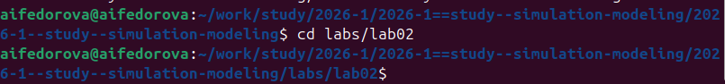
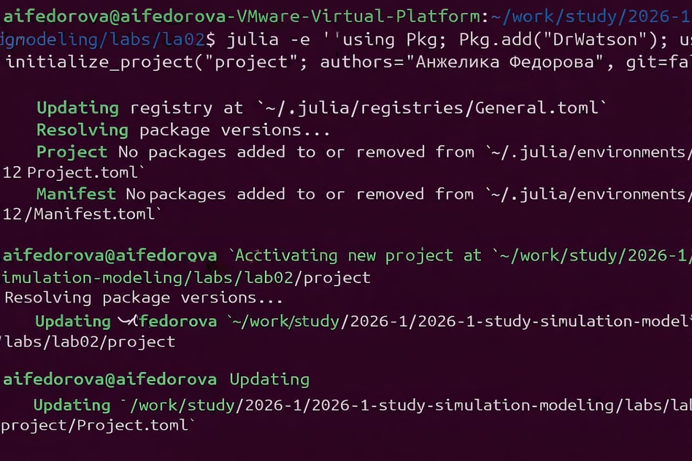
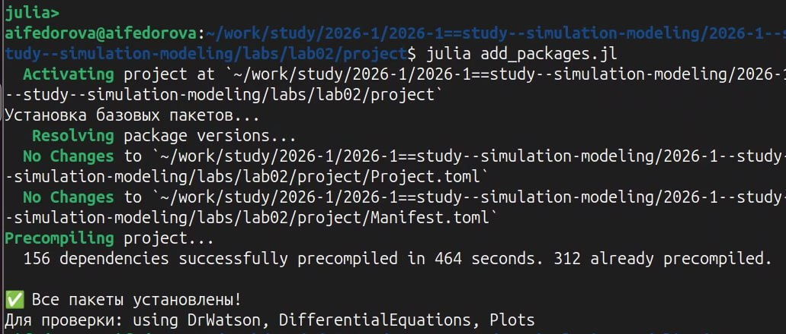
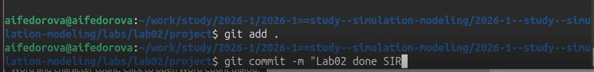

# Информация

## Докладчик

::: {.columns align="center"}
::: {.column width="70%"}
-   Федорова Анжелика Игоревна
-   студентка
-   Российский университет дружбы народов им. П. Лумумбы
-   <1132236011@rudn.ru>
:::

::: {.column width="30%"}
:::
:::

# Вводная часть

## Актуальность

-   Лабораторная работа №2 посвящена численному моделированию
-   Изучаются классические математические модели
-   Модель SIR --- эпидемиологическая динамика
-   Модель Лотки-Вольтерры --- динамика популяций «хищник--жертва»

## Объект и предмет исследования

-   Системы обыкновенных дифференциальных уравнений
-   Инструменты: Julia, DrWatson, Literate, Quarto
-   Численные методы решения ОДУ

## Цели и задачи

-   Создать проект DrWatson с воспроизводимой структурой
-   Реализовать модели SIR и Лотки-Вольтерры на Julia
-   Провести параметрический анализ модели SIR
-   Оформить отчёт в Quarto и зафиксировать результаты в Git

## Материалы и методы

-   Julia --- язык программирования для научных вычислений
-   DrWatson --- фреймворк воспроизводимых проектов
-   DifferentialEquations.jl --- численное решение ОДУ
-   Literate.jl --- литературное программирование
-   Quarto --- генерация отчётов в PDF/HTML

# Выполнение работы

## Шаг 1: Подготовка рабочего окружения

Создаём структуру директорий и переходим в папку второй лабораторной:

``` bash
cd ~/work/study/2026-1/2026-1--study--simulation-modeling/labs/lab02
```

{#fig-001 width="70%"}

## Шаг 2: Создание проекта DrWatson

Инициализация проекта одной командой из терминала:

``` julia
julia -e 'using Pkg; Pkg.add("DrWatson"); using DrWatson;
    initialize_project("project"; authors="Федорова Анжелика Игоревна", git=false)'
cd project
```

{#fig-002 width="70%"}

## Шаг 3: Установка пакетов

Создаём файл `add_packages.jl` и запускаем установку:

``` julia
packages = ["DrWatson", "DifferentialEquations", "Plots", "DataFrames",
    "CSV", "JLD2", "Literate", "IJulia", "BenchmarkTools",
    "Quarto", "StatsPlots", "LaTeXStrings", "FFTW"]
Pkg.add(packages)
```

``` bash
julia add_packages.jl
```

{#fig-003 width="70%"}

## Шаг 4: Скрипт-генератор Literate (tangle.jl)

Создаём `scripts/tangle.jl` --- генерирует три типа файлов:

-   Чистый Julia-скрипт (`scripts/`)
-   Quarto-markdown (`markdown/`)
-   Выполненный Jupyter-ноутбук (`notebooks/`)

## Шаг 5: Базовый скрипт SIR (sir_ode.jl)

Система ОДУ модели SIR:

$$\begin{cases}
\dfrac{dS}{dt} = -\beta c \dfrac{I}{N} S \\[6pt]
\dfrac{dI}{dt} = \beta c \dfrac{I}{N} S - \gamma I \\[6pt]
\dfrac{dR}{dt} = \gamma I
\end{cases}$$

## Шаг 6: Литературный скрипт SIR (sir_literate.jl)

-   Комментарии `##` становятся заголовками Quarto
-   Матформулы вставляются в формате LaTeX
-   Код и пояснения находятся в одном файле
-   Параметры: $\beta=0.05$, $c=10.0$, $\gamma=0.25$, $N=1000$, $I_0=10$

## Шаг 7: Модель Лотки-Вольтерры (lv_literate.jl)

$$\begin{cases}
\dfrac{dx}{dt} = \alpha x - \beta x y \\[6pt]
\dfrac{dy}{dt} = \delta x y - \gamma y
\end{cases}$$

Параметры: $\alpha=0.1$, $\beta=0.02$, $\delta=0.01$, $\gamma=0.3$,
начальные условия: $x_0=40$, $y_0=9$, $T\in[0;\,200]$

## Шаг 8: Параметрический анализ SIR (sir_parametric.jl)

Варьируем параметр заражаемости $\beta$:

``` julia
beta_values = [0.02, 0.05, 0.08, 0.12]
for β in beta_values
    prob = ODEProblem(sir_ode!, [990.0, 10.0, 0.0], (0.0, 40.0),
                     [β, 10.0, 0.25])
    sol  = solve(prob, Tsit5())
    plot!(plt, sol.t, [u[2] for u in sol.u], label="β = $β", lw=2)
end
```

## Шаг 9: Preamble для PDF

Создаём `preamble.tex` в корне проекта для поддержки русского языка:

``` latex
\usepackage{fontspec}
\usepackage{polyglossia}
\setmainlanguage{russian}
\setotherlanguage{english}
\setmainfont{Times New Roman}
\usepackage{amsmath}
\usepackage{amssymb}
```

## Шаг 11: Makefile --- автоматизация

``` makefile
.PHONY: all scripts tangle report clean

all: scripts tangle report

scripts:
    julia --project=. scripts/sir_ode.jl

tangle:
    julia --project=. scripts/tangle.jl scripts/sir_literate.jl
    julia --project=. scripts/tangle.jl scripts/lv_literate.jl
    julia --project=. scripts/tangle.jl scripts/sir_parametric.jl

report:
    quarto render report.qmd --to pdf
```

## Шаг 12: Запуск --- `make all`

Запускаем весь процесс одной командой:

``` bash
make all
```

Это последовательно выполнит: **scripts → tangle → report**

## Шаг 13: Фиксация в Git

После успешного `make all` сохраняем изменения:

``` bash
git add .
git commit -m "Выполнена ЛР №2: SIR и Лотки-Вольтерры"
git push
```

{#fig-013 width="70%"}

# Результаты

## Структура проекта DrWatson

После выполнения всех шагов структура `project/` выглядит так:

    project/
    ├── scripts/        # Исходные Julia-скрипты
    ├── markdown/       # Quarto .qmd (из Literate)
    ├── notebooks/      # Jupyter-ноутбуки (выполненные)
    ├── plots/          # Сохранённые графики
    ├── data/sims/      # Данные симуляций
    ├── preamble.tex    # LaTeX-преамбула
    ├── report.qmd      # Главный отчёт
    └── Makefile        # Автоматизация

## Итоговый слайд

-   Проект полностью воспроизводим командой `make all`
-   Реализованы модели SIR и Лотки-Вольтерры на Julia
-   Проведён параметрический анализ влияния $\beta$ на динамику эпидемии
-   Отчёт оформлен в Quarto PDF с поддержкой русского языка
-   Результаты зафиксированы в Git-репозитории
