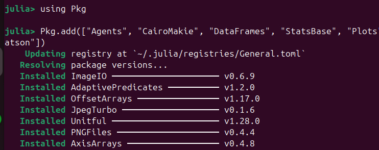
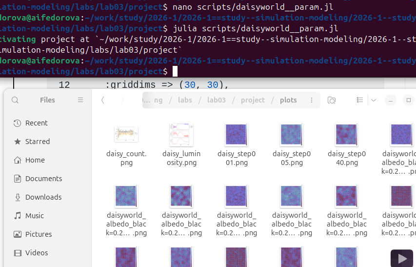
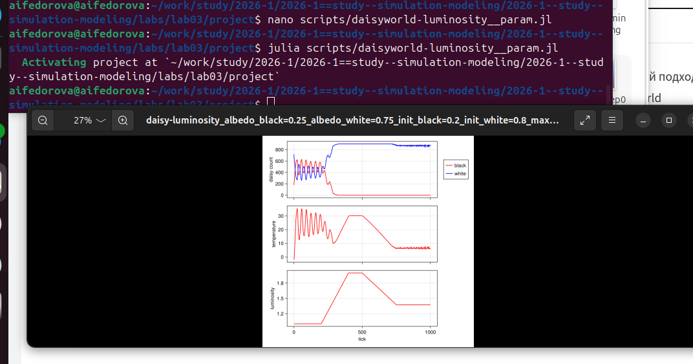

# Вводная часть

## Цель работы

Реализовать агентную модель Daisyworld, провести вычислительные
эксперименты и исследовать поведение системы при различных параметрах.

## Задачи

-   Создать структуру проекта с использованием DrWatson
-   Установить необходимые пакеты (`Agents.jl`, `CairoMakie`,
    `DataFrames`, ...)
-   Реализовать модель Daisyworld на Julia
-   Выполнить визуализацию состояния модели по шагам
-   Построить графики динамики числа маргариток и температуры
-   Провести параметрические эксперименты

# Реализация модели

## Агенты и среда

-   **Агенты:** маргаритки двух пород --- чёрные (`albedo = 0.25`) и
    белые (`albedo = 0.75`)
-   **Среда:** сетка `GridSpaceSingle` размером $30 \times 30$
-   **Атрибуты агента:** порода (`breed`), возраст (`age`), альбедо
    (`albedo`)

## Установка зависимостей



## Запуск модели


## Генерация анимации


## Построение графика численности


## Построение комплексного графика



## Параметрические эксперименты (скриншот)



## Процессы модели

-   **Нагрев поверхности** --- поглощённая светимость → локальный нагрев
    по логарифмическому закону
-   **Диффузия температуры** --- усреднение с 8 соседями (`ratio = 0.5`)
-   **Размножение** --- квадратичная вероятность посева от температуры
-   **Старение** --- агент удаляется по достижении `max_age = 25` шагов

# Базовая визуализация

## Шаг 1 --- начальное состояние

{width="70%"}

## Шаг 5 --- заселение

{width="70%"}

## Шаг 40 --- устойчивая структура

{width="70%"}

Анализ: начальное распределение случайное → кластеризация маргариток →
формируется устойчивая пространственная структура.

# Динамика системы

## Динамика числа маргариток

{width="85%"}

-   Быстрый рост популяции в первые 50 шагов
-   Устойчивые колебания в диапазоне 300--650 особей
-   Популяции чёрных и белых колеблются в антифазе

## Динамика при изменении светимости (сценарий `:ramp`)

{width="60%"}

-   При росте светимости (шаги 200--400) белые маргаритки доминируют
-   При снижении светимости (шаги 500--750) нарастают чёрные
-   Температура следует за светимостью, но сглаживается биотой

# Параметрические эксперименты

## Параметры экспериментов

  Параметр         Значения               Эффект
  ---------------- ---------------------- -----------------------------------------
  `max_age`        25 / 40                Рост `max_age` стабилизирует колебания
  `init_white`     0.2 / 0.8              Высокая доля белых охлаждает планету
  `scenario`       `:default` / `:ramp`   Ramp демонстрирует гипотезу Гайи
  `solar_change`   0.005                  Определяет «остроту» реакции экосистемы

## Метод перебора параметров

DrWatson автоматически генерирует все комбинации и сохраняет результаты
с параметрами в именах файлов:

``` julia
param_dict = Dict(
    :max_age    => [25, 40],
    :init_white => [0.2, 0.8],
    :scenario   => :default,
    :seed       => 165,
)
for params in dict_list(param_dict)
    model = daisyworld(; params...)
    ...
end
```

# Результаты

## Общий анализ

-   **Устойчивость** --- модель выходит на устойчивый режим при широком
    диапазоне начальных условий
-   **Адаптация** --- при изменении солнечной светимости экосистема
    перестраивает состав популяций, сглаживая температуру
-   **Баланс агентов** --- чёрные и белые маргаритки образуют
    конкурентно-кооперативную регуляторную пару
-   **Гипотеза Гайи** --- результаты подтверждают концепцию Watson &
    Lovelock: живые организмы активно регулируют климат планеты

# Выводы

## Итоги работы

::: incremental
-   Реализована полноценная агентная модель Daisyworld на Julia
    (`Agents.jl`)
-   Выполнена визуализация пространственного распределения и временной
    динамики
-   Исследовано влияние ключевых параметров: `max_age`, `init_white`,
    `scenario`
-   Подтверждён эффект саморегуляции: система активно стабилизирует
    температуру
-   Гипотеза Гайи нашла количественное подтверждение в вычислительном
    эксперименте
:::

## Список литературы

1.  Watson A.J., Lovelock J.E. *Biological homeostasis of the global
    environment: the parable of Daisyworld*
2.  Datseris G. et al. *Agents.jl: a performant and feature-full
    agent-based modeling software of minimal code complexity*
3.  Wood A.J. *Daisyworld: A review*
