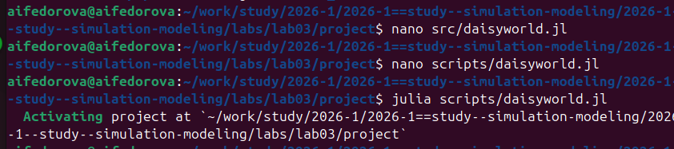
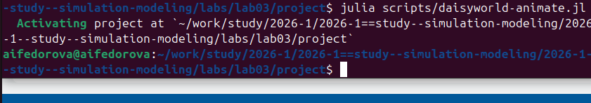
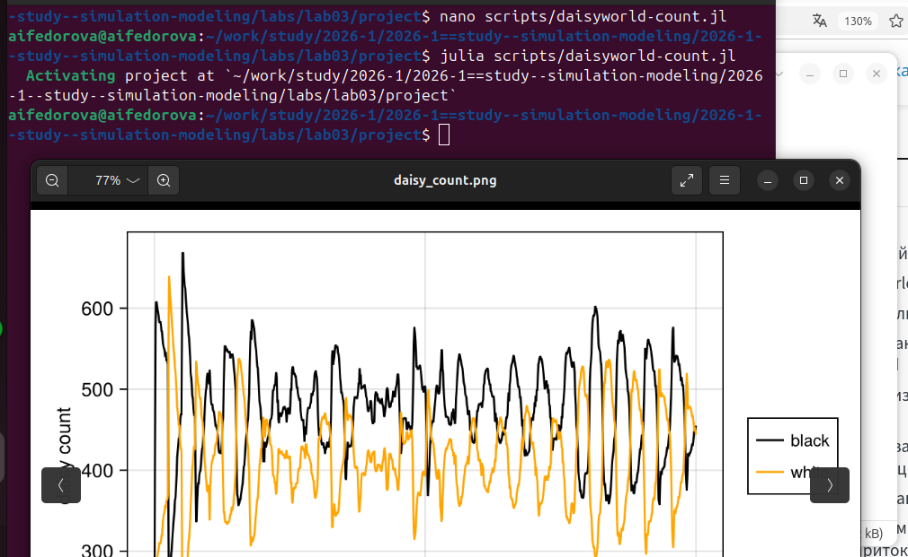
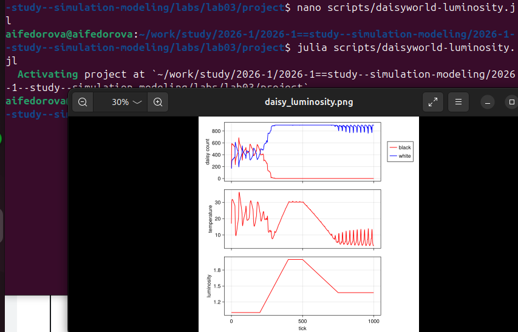
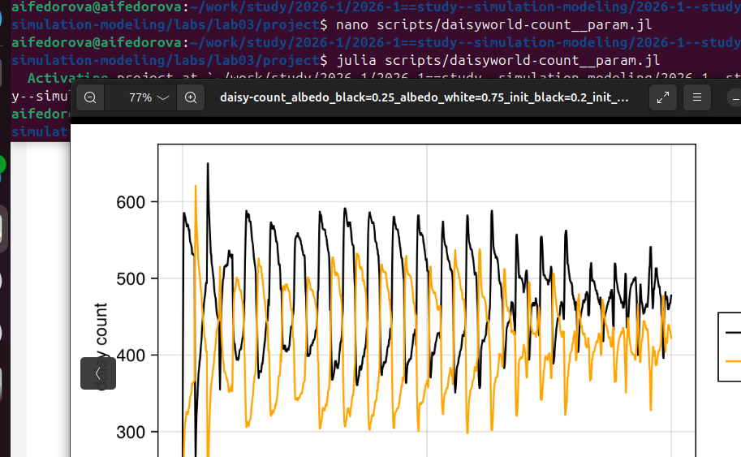

# Цель работы

Реализовать агентную модель Daisyworld, провести вычислительные
эксперименты и исследовать поведение системы при различных параметрах.

# Задание

В ходе работы необходимо:

1.  Создать структуру проекта
2.  Установить необходимые пакеты
3.  Реализовать модель Daisyworld
4.  Выполнить визуализацию
5.  Построить графики динамики
6.  Провести параметрические эксперименты
7.  Оформить отчёт

# Ход работы

## 1. Подготовка проекта

Была создана структура проекта с использованием `DrWatson`:

-   `src/` --- код модели
-   `scripts/` --- исполняемые скрипты
-   `plots/` --- результаты

Установлены пакеты:

``` julia
using Pkg
Pkg.add(["Agents", "CairoMakie", "DataFrames", "StatsBase", "Plots", "DrWatson"])
```

## 2. Реализация модели

Модель реализована в файле:

``` julia

```

Описание:

-   агенты: маргаритки (чёрные и белые)

-   среда: сетка 30×30

-   реализованы процессы:

    -   нагрев поверхности
    -   диффузия температуры
    -   размножение
    -   старение

Подключение модели:

``` julia

```

## 3. Базовая визуализация

Скрипт:

``` julia

```

Результаты:

### Шаг 1


### Шаг 5


### Шаг 40


Анализ:

-   начальное распределение случайное
-   происходит кластеризация маргариток
-   формируется устойчивая структура

## 4. Анимация модели

Скрипт:

``` julia
 
```

Результат загружен на видеохостинг.

Анализ:

-   наблюдается динамическое равновесие
-   популяции колеблются
-   температура стабилизируется

## 5. Динамика числа маргариток

Скрипт:

``` julia

```

Результат:


Анализ:

-   сначала быстрый рост популяции
-   затем колебания
-   система выходит на устойчивый режим

## 6. Динамика модели

Скрипт:

``` julia

```

Результат:


Анализ:

-   при изменении светимости система адаптируется
-   белые маргаритки доминируют при высокой температуре
-   происходит саморегуляция

## 7. Параметрические эксперименты

Скрипты:

``` julia
 




```

Примеры результатов:

``` julia
readdir(plotsdir())
```

Анализ:

-   увеличение `init_white` → охлаждение системы
-   увеличение `max_age` → стабилизация
-   параметры существенно влияют на динамику

# Общий анализ

Модель демонстрирует:

-   устойчивость системы
-   адаптацию к изменениям среды
-   баланс между агентами

Это подтверждает гипотезу о саморегуляции системы.

# Подтверждение выполнения (скриншоты)

В данном разделе приведены скриншоты выполнения лабораторной работы.

## Установка зависимостей


## Запуск модели



## Генерация анимации



## Построение графика численности




## Построение комплексного графика




## Параметрические эксперименты




# Выводы

В ходе лабораторной работы:

-   реализована агентная модель Daisyworld
-   выполнена визуализация и анализ
-   исследовано влияние параметров
-   подтверждён эффект саморегуляции

# Список литературы

1.  Watson A.J., Lovelock J.E.
2.  Datseris G. Agents.jl
3.  Wood A.J. Daisyworld review
