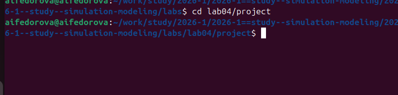
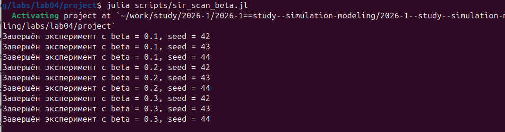
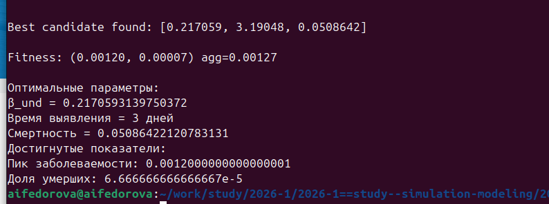

# Вводная часть

## Актуальность

-   Эпидемии инфекционных заболеваний представляют серьёзную угрозу для
    общества
-   Классические модели на ОДУ не учитывают пространственную структуру и
    стохастичность
-   Агентное моделирование позволяет воспроизвести реалистичную динамику
    распространения инфекции
-   Необходимы инструменты для анализа влияния параметров (заразность,
    миграция) на ход эпидемии

## Цель работы

Реализовать агентную модель SIR на языке Julia с использованием пакета
`Agents.jl` и исследовать влияние параметров модели на динамику эпидемии

## Задачи

-   Реализовать агентную SIR-модель с учётом миграции между городами
-   Провести базовый эксперимент и визуализировать динамику
-   Выполнить параметрическое сканирование коэффициента заразности
    $\beta$
-   Исследовать эффект интенсивности миграции на распространение
    инфекции
-   Провести многокритериальную оптимизацию параметров модели

## Объект и предмет исследования

-   **Объект:** популяция из трёх городов по 1000 жителей каждый
-   **Предмет:** динамика распространения инфекционного заболевания в
    агентной метапопуляционной модели SIR

## Материалы и методы

-   Язык программирования **Julia**
-   Пакет **Agents.jl** --- агентное моделирование
-   Пакет **BlackBoxOptim.jl** --- многокритериальная оптимизация (Borg
    MOEA)
-   Пакеты **Plots.jl**, **DataFrames.jl**, **CSV.jl** --- визуализация
    и анализ данных
-   Пакет **DrWatson.jl** --- управление проектом

# Теоретическая часть

## Классическая модель SIR

Три компартмента:

-   **S** (Susceptible) --- восприимчивые
-   **I** (Infectious) --- инфицированные
-   **R** (Recovered) --- выздоровевшие

$$\frac{dS}{dt} = -\beta SI, \quad \frac{dI}{dt} = \beta SI - \gamma I, \quad \frac{dR}{dt} = \gamma I$$

## Агентный подход: преимущества

::: incremental
-   Каждый индивид моделируется отдельно с уникальными характеристиками
-   Взаимодействия происходят локально --- учитывается пространственная
    структура
-   Процессы стохастические --- учитываются случайные флуктуации
-   Возможна метапопуляционная динамика (несколько городов + миграция)
:::

## Структура агента и параметры модели

Каждый агент имеет:

-   `status::Symbol` --- состояние (`:S`, `:I`, `:R`)
-   `days_infected::Int` --- дней с момента заражения

Ключевые параметры:

-   $\beta_{und}$, $\beta_{det}$ --- заразность до и после выявления
-   `infection_period`, `detection_time` --- длительность болезни и
    время выявления
-   `death_rate`, `reinfection_probability` --- смертность и повторное
    заражение
-   `migration_rates` --- матрица миграции между городами

# Выполнение работы

## Создание проекта

{width="90%"}

## Написание скриптов

{width="90%"}

## Базовый эксперимент: параметры

-   3 города × 1000 жителей = 3000 агентов
-   $\beta_{und} = 0.5$, $\beta_{det} = 0.05$
-   `infection_period` = 14 дней, `detection_time` = 7 дней
-   `death_rate` = 0.02, `reinfection_probability` = 0.1
-   Начало: 1 инфицированный в 3-м городе

## Базовый эксперимент: результат

{width="75%"}

## Сканирование коэффициента заразности

{width="90%"}

## Результаты сканирования β

{width="75%"}

## Выводы по сканированию β

-   При $\beta < 0.2$ эпидемия не развивается ($R_0 < 1$)
-   При $\beta \approx 0.2$ --- пороговый переход, начало эпидемии
-   При $\beta \geq 0.5$ --- пиковая заболеваемость насыщается (≈ 100%
    популяции)
-   Число умерших растёт с 0 до 350--410 человек из 3000

## Данные экспериментов по миграции

{width="80%"}

## Результаты исследования миграции

{width="75%"}

## Выводы по миграции

-   При нулевой миграции эпидемия охватывает только 1 город (\~33%
    популяции)
-   Уже при интенсивности 0.1 эпидемия распространяется на все 3 города
    (100%)
-   Время до пика: 15--22 дня при любой ненулевой миграции
-   **Вывод:** изоляция городов критически важна для ограничения
    распространения

## Многокритериальная оптимизация

Метод: **Borg MOEA** (пакет `BlackBoxOptim.jl`)

Минимизируемые критерии:

-   Пиковая доля инфицированных
-   Доля умерших

Переменные: $\beta_{und} \in [0.1, 1.0]$, время выявления $\in [3, 14]$
дней, смертность $\in [0.01, 0.1]$

## Результаты оптимизации

{width="90%"}

Найденные оптимальные параметры:

-   $\beta_{und} \approx 0.217$, время выявления = **3 дня**, смертность
    $\approx 0.051$
-   Пик заболеваемости: $\approx 1.2 \times 10^{-3}$, доля умерших:
    $\approx 6.7 \times 10^{-5}$

## Сводная визуализация

{width="58%"}

# Результаты и выводы

## Итоги работы

::: incremental
-   Реализована агентная SIR-модель с миграцией на языке Julia
    (`Agents.jl`)
-   Подтверждён пороговый характер эпидемии: $\beta \approx 0.2$
    соответствует $R_0 = 1$
-   Показана критическая роль миграции: нулевая миграция ограничивает
    очаг одним городом
-   Оптимальная стратегия --- раннее выявление (3 дня) при умеренной
    заразности
:::

## Ключевые результаты

  Эксперимент      Вывод
  ---------------- -----------------------------------------------
  Базовый          Волнообразная динамика с повторными вспышками
  Сканирование β   Порог при β ≈ 0.2, насыщение при β ≥ 0.5
  Миграция         Любая ненулевая миграция → вся популяция
  Оптимизация      Раннее выявление минимизирует оба критерия

## Главный вывод

Агентный подход превосходит классические ОДУ-модели в реалистичности:

-   учитывает стохастичность и пространственную структуру
-   позволяет моделировать метапопуляционную динамику
-   даёт основу для анализа мер контроля (карантин, выявление)
