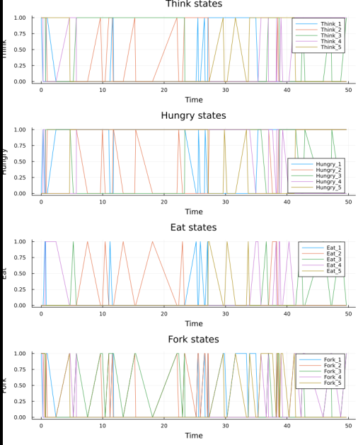
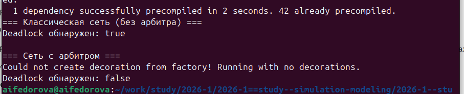
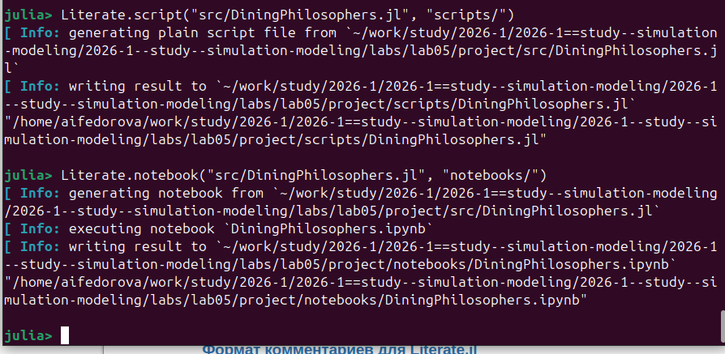

# Информация

## Докладчик

::: {.columns align="center"}
::: {.column width="70%"}
-   Федорова Анжелика Игоревна
-   студентка группы НКНбд-01-23
-   Российский университет дружбы народов им. П. Лумумбы
-   <1132236011@rudn.ru>
:::

::: {.column width="30%"}
:::
:::

# Вводная часть

## Актуальность

-   Параллельные и распределённые системы повсеместны: ОС, БД, сети
-   Проблемы синхронизации --- взаимные блокировки (deadlock), голодание
    (starvation) --- трудно отлаживать
-   Сети Петри --- строгий математический аппарат для **формального**
    анализа таких систем
-   Задача «Обедающие философы» --- классический учебный пример для
    демонстрации deadlock

## Цели и задачи

-   Освоить математический аппарат сетей Петри
-   Построить сеть Петри для задачи «Обедающие философы» (N = 5)
-   Обнаружить состояние **deadlock** экспериментально
-   Модифицировать сеть с **арбитром** для предотвращения тупика
-   Провести стохастическое и детерминированное моделирование
-   Визуализировать результаты: графики маркировки, анимация GIF

## Материалы и методы

-   Язык программирования **Julia**
-   Пакеты: `OrdinaryDiffEq`, `Plots`, `DataFrames`, `CSV`, `Literate`
-   Управление проектом: **DrWatson**
-   Стохастическое моделирование: **алгоритм Гиллеспи**
-   Детерминированное моделирование: система ОДУ (метод Tsit5)
-   Literate Programming: генерация скрипта, Jupyter Notebook, Quarto

# Теория

## Сеть Петри: определение

Сеть Петри --- это четвёрка:

$$N = (P,\; T,\; F,\; M_0)$$

::: incremental
-   $P = \{p_1, p_2, \ldots, p_n\}$ --- конечное множество **позиций**
-   $T = \{t_1, t_2, \ldots, t_m\}$ --- конечное множество **переходов**
-   $F \subseteq (P \times T) \cup (T \times P)$ --- множество **дуг**
-   $M_0 : P \to \mathbb{N}$ --- начальная **маркировка**
:::

## Сеть Петри: элементы

::: columns
::: {.column width="50%"}
**Позиции** (кружки)

-   Пассивные элементы
-   Описывают состояние системы
-   Содержат **фишки** --- количество ресурсов

**Переходы** (прямоугольники)

-   Активные элементы
-   Моделируют события и действия
:::

::: {.column width="50%"}
**Правило срабатывания:**

Переход **разрешён**, если каждая входная позиция содержит достаточно
фишек. При срабатывании:

-   фишки из входных позиций **удаляются**
-   фишки в выходных позициях **добавляются**
:::
:::

## Задача «Обедающие философы»

::: columns
::: {.column width="55%"}
-   N = 5 философов сидят за круглым столом
-   Между каждыми двумя соседями --- одна **вилка**
-   Чтобы есть --- нужны **обе вилки** (левая и правая)
-   Три состояния: **думает → голоден → ест**

**Проблема:** при наивной реализации все философы берут левую вилку и
**ждут правую** → система замирает
:::

::: {.column width="45%"}

:::
:::

# Реализация

## Структура модуля `DiningPhilosophers.jl`

``` julia
struct PetriNet
    n_places::Int
    n_transitions::Int
    incidence::Matrix{Int}    # матрица инцидентности
    place_names::Vector{Symbol}
    transition_names::Vector{Symbol}
end
```

-   **4N позиций**: `Think_i`, `Hungry_i`, `Eat_i`, `Fork_i`
-   **3N переходов**: `GetLeft_i`, `GetRight_i`, `PutForks_i`
-   Начальная маркировка: `Think_i = 1`, `Fork_i = 1`

## Классическая сеть: дуги переходов

``` julia
# Философ i берёт левую вилку: Think → Hungry
add_arc!(net, think,     get_left, -1)
add_arc!(net, left_fork, get_left, -1)
add_arc!(net, hungry,    get_left, +1)

# Берёт правую вилку: Hungry → Eat
add_arc!(net, hungry,      get_right, -1)
add_arc!(net, right_fork,  get_right, -1)
add_arc!(net, eat,         get_right, +1)

# Кладёт вилки: Eat → Think
add_arc!(net, eat,        put_forks, -1)
add_arc!(net, think,      put_forks, +1)
add_arc!(net, left_fork,  put_forks, +1)
add_arc!(net, right_fork, put_forks, +1)
```

## Алгоритм Гиллеспи (стохастика)

``` julia
while t < tmax
    # 1. Вычислить пропенсити всех переходов
    a[j] = rate * prod(u[i]^(-incidence[i,j]) for i where incidence<0)
    a0 = sum(a)
    if a0 == 0; break; end   # deadlock!

    # 2. Случайный шаг времени
    dt = -log(rand()) / a0

    # 3. Выбрать переход пропорционально пропенсити
    chosen = sample(transitions, weights=a)

    # 4. Обновить маркировку
    u .+= incidence[:, chosen]
    t += dt
end
```

## Инициализация проекта

``` bash
julia
```

``` julia
using DrWatson
initialize_project("project"; authors=["Fyodorova Angelica"])
```


# Результаты

## Запуск моделирования

``` julia
N = 5;  tmax = 50.0

net_classic, u0, _ = build_classical_network(N)
df = simulate_stochastic(net_classic, u0, tmax)
dead = detect_deadlock(df, net_classic)
println("Deadlock обнаружен: $dead")
```



## Классическая сеть: deadlock

{width="90%"}

## Классическая сеть: наблюдения

::: incremental
-   До t ≈ 2.2: философы успевают поесть по 1--2 раза
-   Затем **все** переходят в состояние `Hungry`
-   `Eat_i = 0` для всех i --- никто не ест
-   `Fork_i = 0` для всех i --- все вилки «захвачены»
-   `detect_deadlock` возвращает **`true`**
-   Система **заморожена** навсегда
:::

## Сеть с арбитром: идея

::: columns
::: {.column width="55%"}
Добавляется позиция **`Arbiter`** с $N - 1 = 4$ фишками.

Переход `GetLeft_i` требует **фишку арбитра**:

``` julia
add_arc!(net, arbiter_idx, get_left, -1)
```

Переход `PutForks_i` возвращает фишку:

``` julia
add_arc!(net, arbiter_idx, put_forks, +1)
```
:::

::: {.column width="45%"}
**Эффект:** не более 4 философов одновременно могут взять левую вилку →
круговое ожидание невозможно
:::
:::

## Сеть с арбитром: результат

{width="90%"}

## Сравнительный анализ

{width="90%"}

## Интерпретация сравнения

::: columns
::: {.column width="50%"}
**Классическая сеть**

-   Активность `Eat_i` прекращается к t ≈ 1.5
-   Система необратимо блокируется
-   `detect_deadlock` → **`true`**
:::

::: {.column width="50%"}
**Сеть с арбитром**

-   Философы непрерывно чередуются
-   Нет длительных нулевых периодов
-   `detect_deadlock` → **`false`**
:::
:::

## Анимация сети Петри

``` julia
anim = @animate for row in eachrow(df)
    u = [row[col] for col in propertynames(row)
                  if col != :time]
    bar(1:length(u), u,
        title = "Время = $(round(row.time, digits=2))",
        xlabel = "Позиция", ylabel = "Фишки")
    xticks!(1:length(u), string.(names), rotation=45)
end
gif(anim, plotsdir("philosophers_simulation.gif"), fps=2)
```


# Literate Programming

## Генерация артефактов из одного источника

``` julia
using Literate

# Чистый скрипт Julia
Literate.script("src/DiningPhilosophers.jl", "scripts/")

# Jupyter Notebook (с выполнением)
Literate.notebook("src/DiningPhilosophers.jl", "notebooks/")

# Документация Markdown / Quarto
Literate.markdown("src/DiningPhilosophers.jl", "docs/")
```



## Что получилось

::: incremental
-   `scripts/DiningPhilosophers.jl` --- чистый исполняемый скрипт
-   `notebooks/DiningPhilosophers.ipynb` --- Jupyter Notebook, выполнен
    автоматически
-   `docs/DiningPhilosophers.md` --- документация для Quarto
-   Единый источник правды --- изменение кода в `.jl` обновляет все
    артефакты
:::

# Выводы

## Итоги

::: incremental
1.  **Построена** сеть Петри для N = 5 философов: 20 позиций, 15
    переходов
2.  **Deadlock подтверждён** экспериментально --- стохастическая
    симуляция неизбежно приходит к тупику
3.  **Арбитр решает проблему** --- 4 фишки в позиции `Arbiter` исключают
    круговое ожидание
4.  **Визуализация** (графики, GIF-анимация, итоговый отчёт) наглядно
    демонстрирует разницу между моделями
5.  **Инструменты** DrWatson + Literate.jl обеспечивают
    воспроизводимость и структуру проекта
:::

## Практическая значимость

Принципы, изученные на задаче философов, применимы к реальным системам:

-   **Базы данных** --- конкурентный доступ к таблицам, deadlock
    транзакций
-   **Операционные системы** --- планирование процессов, управление
    ресурсами
-   **Сетевые протоколы** --- синхронизация распределённых узлов
-   **Производство** --- моделирование гибких производственных линий

Сеть Петри с арбитром --- аналог **семафора** в операционных системах.

## Список литературы {#список-литературы .unnumbered}

-   Методическое пособие по дисциплине «Имитационное моделирование»,
    лабораторная работа №5: Аппарат сетей Петри.
-   Petri C. A. «Kommunikation mit Automaten». Dissertation, Universität
    Bonn, 1962.
-   Dijkstra E. W. «Cooperating Sequential Processes». Technical Report
    EWD-123, 1965.
