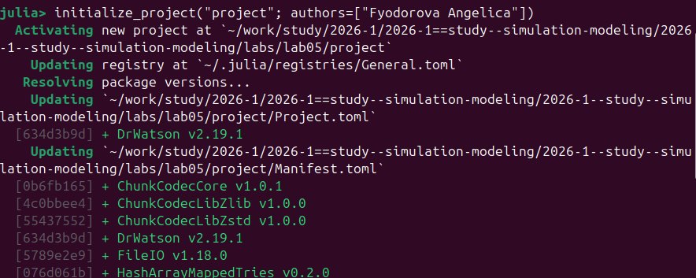
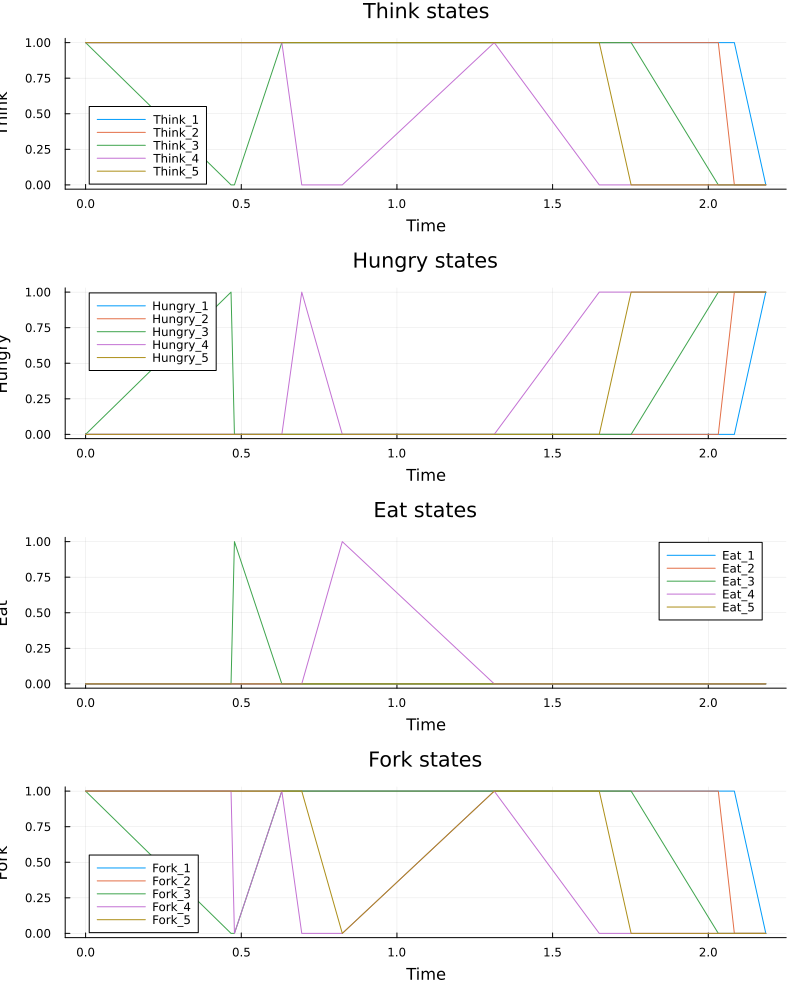
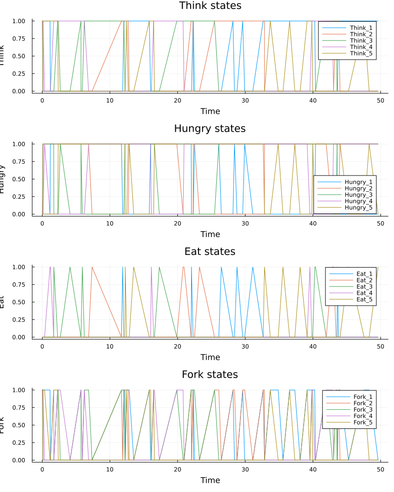
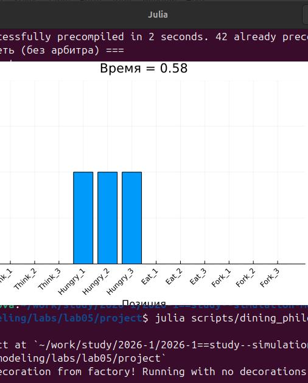
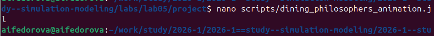
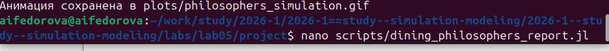
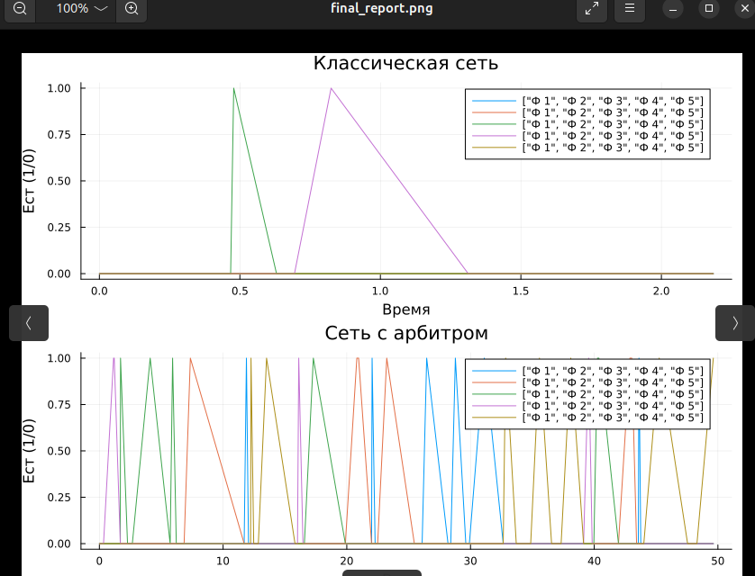
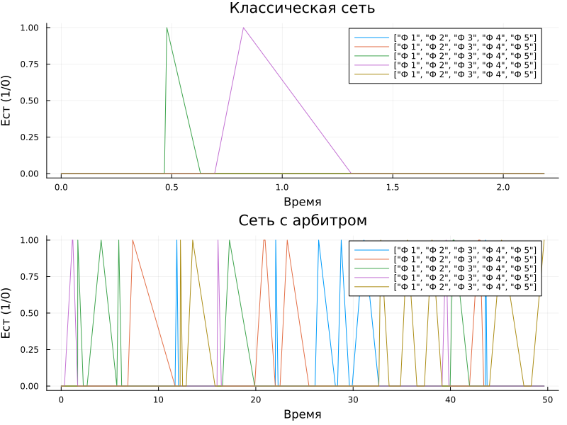

---
## Author
author:
  name: Федорова Анжелика Игоревна
  email: 1132236011@rudn.ru
  affiliation:
    - name: Российский университет дружбы народов
      country: Российская Федерация
      city: Москва
      address: ул. Миклухо-Маклая, д. 6

## Title
title: "Отчёта по лабораторной работе №5"
subtitle: "Задача «Обедающие философы»"
license: "CC BY"
---

## Цель работы

Целью данной лабораторной работы является освоение математического аппарата сетей Петри для моделирования дискретных параллельных систем на примере классической задачи «Обедающие философы». В ходе работы требуется:

- построить сеть Петри для пяти философов, моделируя захват и освобождение вилок;
- обнаружить состояние взаимной блокировки (deadlock);
- провести имитационное моделирование (стохастическое и детерминированное);
- модифицировать сеть с арбитром для предотвращения deadlock;
- проанализировать результаты и оформить отчёт с графиками и анимацией.

---

## Задание

1. Создать рабочий каталог для кода и установить необходимые пакеты.
2. Выполнить предложенный код модели сетей Петри.
3. Преобразовать код в литературный стиль (Literate Programming).
4. Сгенерировать из литературного кода: чистый скрипт, Jupyter Notebook, документацию в формате Quarto.
5. Добавить параметрическое моделирование (перебор параметров).
6. Интегрировать документацию Quarto в итоговый отчёт.

---

## Теоретическое введение

**Сеть Петри** — математический аппарат для моделирования дискретных систем. Формально определяется как четвёрка:

$$N = (P, T, F, M_0)$$

где $P$ — множество позиций, $T$ — множество переходов, $F$ — множество дуг, $M_0$ — начальная маркировка.

Основные элементы:

- **Позиции** (кружки) — пассивные элементы, описывающие состояния системы;
- **Переходы** (прямоугольники) — активные элементы, моделирующие события;
- **Фишки** — символизируют количество ресурсов или кратность выполнения условия;
- **Дуги** — направленные связи между позициями и переходами.

**Задача «Обедающие философы»** сформулирована Эдсгером Дейкстрой в 1965 году. За круглым столом сидят N = 5 философов, между каждыми двумя соседями лежит одна вилка. Чтобы поесть, философу нужны обе вилки — левая и правая. При наивной реализации возникает **deadlock**: все философы одновременно берут левую вилку и ждут правую, которую никто не отпускает.

Для предотвращения deadlock вводится **арбитр** — дополнительная позиция с $N-1 = 4$ фишками, не позволяющая всем пяти философам одновременно претендовать на вилки.

---

## Выполнение лабораторной работы

### 1. Создание проекта и установка пакетов

Инициализирован Julia-проект с помощью DrWatson. В Julia REPL выполнена команда:

```julia
initialize_project("project"; authors=["Fyodorova Angelica"])
```

В результате DrWatson создал структуру проекта, активировал окружение и установил необходимые зависимости, в том числе сам DrWatson v2.19.1.



---

### 2. Модуль `src/DiningPhilosophers.jl`

Создан основной модуль, содержащий структуру сети Петри, построение обеих моделей, оба метода моделирования и функции визуализации.

```julia
module DiningPhilosophers

using OrdinaryDiffEq
using Plots
using DataFrames
using Random, LinearAlgebra

export build_classical_network, build_arbiter_network
export simulate_ode, simulate_stochastic
export detect_deadlock, plot_marking_evolution

# Определение структуры PetriNet
struct PetriNet
    n_places::Int
    n_transitions::Int
    incidence::Matrix{Int}
    place_names::Vector{Symbol}
    transition_names::Vector{Symbol}
end

function PetriNet(
    n_places,
    n_transitions;
    place_names = Symbol[],
    transition_names = Symbol[],
)
    incidence = zeros(Int, n_places, n_transitions)
    if isempty(place_names)
        place_names = [Symbol("p$i") for i = 1:n_places]
    end
    if isempty(transition_names)
        transition_names = [Symbol("t$i") for i = 1:n_transitions]
    end
    PetriNet(n_places, n_transitions, incidence, place_names, transition_names)
end

function add_arc!(net::PetriNet, place::Int, transition::Int, sign::Int)
    net.incidence[place, transition] += sign
end

# -- Построение классической сети ----------------------------------------------
function build_classical_network(N::Int)
    n_places = 4N
    n_transitions = 3N
    net = PetriNet(n_places, n_transitions)

    for i = 1:N
        net.place_names[i]    = Symbol("Think_$i")
        net.place_names[N+i]  = Symbol("Hungry_$i")
        net.place_names[2N+i] = Symbol("Eat_$i")
        net.place_names[3N+i] = Symbol("Fork_$i")
    end
    for i = 1:N
        net.transition_names[i]    = Symbol("GetLeft_$i")
        net.transition_names[N+i]  = Symbol("GetRight_$i")
        net.transition_names[2N+i] = Symbol("PutForks_$i")
    end

    for i = 1:N
        think      = i
        hungry     = N + i
        eat        = 2N + i
        left_fork  = 3N + i
        right_fork = 3N + (i % N + 1)
        get_left   = i
        get_right  = N + i
        put_forks  = 2N + i

        add_arc!(net, think,      get_left,  -1)
        add_arc!(net, left_fork,  get_left,  -1)
        add_arc!(net, hungry,     get_left,  +1)
        add_arc!(net, hungry,     get_right, -1)
        add_arc!(net, right_fork, get_right, -1)
        add_arc!(net, eat,        get_right, +1)
        add_arc!(net, eat,        put_forks, -1)
        add_arc!(net, think,      put_forks, +1)
        add_arc!(net, left_fork,  put_forks, +1)
        add_arc!(net, right_fork, put_forks, +1)
    end

    u0 = zeros(Float64, n_places)
    for i = 1:N
        u0[i]    = 1.0   # Think_i
        u0[3N+i] = 1.0   # Fork_i
    end
    return net, u0, net.place_names
end

# -- Построение сети с арбитром ------------------------------------------------
function build_arbiter_network(N::Int)
    n_places = 4N + 1
    n_transitions = 3N
    net = PetriNet(n_places, n_transitions)

    for i = 1:N
        net.place_names[i]    = Symbol("Think_$i")
        net.place_names[N+i]  = Symbol("Hungry_$i")
        net.place_names[2N+i] = Symbol("Eat_$i")
        net.place_names[3N+i] = Symbol("Fork_$i")
    end
    net.place_names[4N+1] = :Arbiter

    for i = 1:N
        net.transition_names[i]    = Symbol("GetLeft_$i")
        net.transition_names[N+i]  = Symbol("GetRight_$i")
        net.transition_names[2N+i] = Symbol("PutForks_$i")
    end

    arbiter_idx = 4N + 1
    for i = 1:N
        think      = i
        hungry     = N + i
        eat        = 2N + i
        left_fork  = 3N + i
        right_fork = 3N + (i % N + 1)
        get_left   = i
        get_right  = N + i
        put_forks  = 2N + i

        add_arc!(net, think,       get_left,  -1)
        add_arc!(net, left_fork,   get_left,  -1)
        add_arc!(net, arbiter_idx, get_left,  -1)  # арбитр блокирует
        add_arc!(net, hungry,      get_left,  +1)
        add_arc!(net, hungry,      get_right, -1)
        add_arc!(net, right_fork,  get_right, -1)
        add_arc!(net, eat,         get_right, +1)
        add_arc!(net, eat,         put_forks, -1)
        add_arc!(net, think,       put_forks, +1)
        add_arc!(net, left_fork,   put_forks, +1)
        add_arc!(net, right_fork,  put_forks, +1)
        add_arc!(net, arbiter_idx, put_forks, +1)  # арбитр освобождается
    end

    u0 = zeros(Float64, n_places)
    for i = 1:N
        u0[i]    = 1.0
        u0[3N+i] = 1.0
    end
    u0[arbiter_idx] = N - 1   # 4 фишки
    return net, u0, net.place_names
end

# -- Детерминированное моделирование (ODE) -------------------------------------
function vectorfield(net::PetriNet, rates = ones(net.n_transitions))
    function f!(du, u, params, t)
        a = zeros(net.n_transitions)
        for j = 1:net.n_transitions
            prod = rates[j]
            for i = 1:net.n_places
                if net.incidence[i, j] < 0
                    prod *= u[i] ^ (-net.incidence[i, j])
                end
            end
            a[j] = prod
        end
        du .= net.incidence * a
    end
    return f!
end

function simulate_ode(net::PetriNet, u0::Vector{Float64}, tmax::Float64; saveat = 0.1)
    f    = vectorfield(net)
    prob = ODEProblem(f, u0, (0.0, tmax))
    sol  = solve(prob, Tsit5(), saveat = saveat)
    df   = DataFrame(time = sol.t)
    for i = 1:net.n_places
        df[!, String(net.place_names[i])] = sol[i, :]
    end
    return df
end

# -- Стохастическое моделирование (алгоритм Гиллеспи) -------------------------
function simulate_stochastic(
    net::PetriNet,
    u0::Vector{Float64},
    tmax::Float64;
    rates = ones(net.n_transitions),
    rng   = Random.GLOBAL_RNG,
)
    u      = copy(u0)
    t      = 0.0
    times  = [t]
    states = [copy(u)]

    while t < tmax
        a = zeros(net.n_transitions)
        for j = 1:net.n_transitions
            prod = rates[j]
            for i = 1:net.n_places
                if net.incidence[i, j] < 0
                    prod *= u[i] ^ (-net.incidence[i, j])
                end
            end
            a[j] = prod
        end

        a0 = sum(a)
        if a0 == 0
            break   # deadlock
        end

        dt = -log(rand(rng)) / a0
        r  = rand(rng) * a0

        cumsum = 0.0
        chosen = 1
        for j = 1:net.n_transitions
            cumsum += a[j]
            if r <= cumsum
                chosen = j
                break
            end
        end

        for i = 1:net.n_places
            u[i] += net.incidence[i, chosen]
        end
        t += dt
        if t <= tmax
            push!(times,  t)
            push!(states, copy(u))
        end
    end

    df = DataFrame(time = times)
    for i = 1:net.n_places
        df[!, String(net.place_names[i])] = [s[i] for s in states]
    end
    return df
end

# -- Обнаружение deadlock ------------------------------------------------------
function detect_deadlock(df::DataFrame, net::PetriNet; tol = 1e-6)
    u_last = [df[end, String(net.place_names[i])] for i = 1:net.n_places]
    for j = 1:net.n_transitions
        can_fire = true
        for i = 1:net.n_places
            if net.incidence[i, j] < 0 && u_last[i] < -net.incidence[i, j] - tol
                can_fire = false
                break
            end
        end
        if can_fire
            return false
        end
    end
    return true
end

# -- Визуализация --------------------------------------------------------------
function plot_marking_evolution(df::DataFrame, N::Int)
    plots = []
    for group in ["Think", "Hungry", "Eat", "Fork"]
        p = plot(xlabel = "Time", ylabel = group, title = "$group states")
        for i = 1:N
            col = "$(group)_$i"
            if col in names(df)
                plot!(df.time, df[!, col], label = "$(group)_$i")
            end
        end
        push!(plots, p)
    end
    return plot(plots..., layout = (4, 1), size = (800, 1000))
end

end # module
```

### 3. Скрипт основного моделирования `scripts/dining_philosophers.jl`

Запускает стохастическую симуляцию для обеих моделей, сохраняет CSV-файлы и графики, выводит результат `detect_deadlock`.

```julia
using DrWatson
@quickactivate "project"
include(srcdir("DiningPhilosophers.jl"))
using .DiningPhilosophers
using DataFrames, CSV, Plots

N    = 5
tmax = 50.0

# -- Классическая сеть ---------------------------------------------------------
println("=== Классическая сеть (без арбитра) ===")
net_classic, u0_classic, _ = build_classical_network(N)
df_classic = simulate_stochastic(net_classic, u0_classic, tmax)
CSV.write(datadir("dining_classic.csv"), df_classic)
dead = detect_deadlock(df_classic, net_classic)
println("Deadlock обнаружен: $dead")
plot_classic = plot_marking_evolution(df_classic, N)
savefig(plotsdir("classic_simulation.png"))

# -- Сеть с арбитром -----------------------------------------------------------
println("\n=== Сеть с арбитром ===")
net_arb, u0_arb, _ = build_arbiter_network(N)
df_arb = simulate_stochastic(net_arb, u0_arb, tmax)
CSV.write(datadir("dining_arbiter.csv"), df_arb)
dead_arb = detect_deadlock(df_arb, net_arb)
println("Deadlock обнаружен: $dead_arb")
plot_arb = plot_marking_evolution(df_arb, N)
savefig(plotsdir("arbiter_simulation.png"))
```

Запущен скрипт для N = 5, tmax = 50.0. Консольный вывод подтвердил ожидаемые результаты:

- **Классическая сеть** → `Deadlock обнаружен: true`
- **Сеть с арбитром** → `Deadlock обнаружен: false`


---

### 4. Графики маркировки классической сети

По результатам стохастической симуляции построены графики эволюции маркировки для всех позиций классической сети. На графиках видно, что примерно к моменту времени t ≈ 42–45 все философы переходят в состояние `Hungry`, а активность в `Eat` и `Fork` прекращается — система входит в состояние deadlock.


Детерминированное (ODE) моделирование классической сети дополнительно подтверждает этот эффект: на горизонте t ∈ [0, 2.2] чётко прослеживается, как философы последовательно переходят из `Think` в `Hungry`, успевают поесть лишь двое (Eat_3 и Eat_4), а затем система застывает — все оставшиеся философы зависают в `Hungry`, вилки израсходованы и переходы более не срабатывают.



### 4а. Графики маркировки сети с арбитром

В сети с арбитром (N-1 = 4 фишки в позиции Arbiter) философы непрерывно чередуются между состояниями Think → Hungry → Eat на протяжении всего времени моделирования (tmax = 50). Ни один из четырёх графиков не демонстрирует «замерзания» — система жива.



---

### 5. Анимация динамики сети Петри

Для наглядной демонстрации создан скрипт `scripts/dining_philosophers_animation.jl`. Анимация строилась для упрощённой сети с N = 3 философами (tmax = 30.0, fps = 2). На каждом кадре отображается столбчатая диаграмма текущей маркировки всех позиций.

На скриншоте показан кадр анимации в момент времени t = 0.58: все три философа находятся в состоянии `Hungry` — это начало развития тупиковой ситуации.



Скрипт `scripts/dining_philosophers_animation.jl` редактировался в терминале командой `nano`:

```bash
nano scripts/dining_philosophers_animation.jl
```



Содержимое скрипта анимации:

```julia
using DrWatson
@quickactivate "project"
include(srcdir("DiningPhilosophers.jl"))
using .DiningPhilosophers
using Plots, Random

N    = 3       # малое число для упрощения визуализации
tmax = 30.0
net, u0, names = build_classical_network(N)
Random.seed!(123)
df = simulate_stochastic(net, u0, tmax)

anim = @animate for row in eachrow(df)
    u = [row[col] for col in propertynames(row) if col != :time]
    bar(
        1:length(u),
        u,
        legend = false,
        ylims  = (0, maximum(u0) + 1),
        xlabel = "Позиция",
        ylabel = "Фишки",
        title  = "Время = $(round(row.time, digits=2))",
    )
    xticks!(1:length(u), string.(names), rotation = 45)
end

gif(anim, plotsdir("philosophers_simulation.gif"), fps = 2)
println("Анимация сохранена в plots/philosophers_simulation.gif")
```

Анимация успешно сохранена в файл `plots/philosophers_simulation.gif`.

---

### 6. Итоговый сравнительный отчёт

Создан скрипт `scripts/dining_philosophers_report.jl`, который загружает ранее сохранённые CSV-файлы и строит сравнительный график числа «едящих» философов (`Eat_i`) для двух моделей.

```bash
nano scripts/dining_philosophers_report.jl
```



Содержимое скрипта:

```julia
using DrWatson
@quickactivate "project"
using DataFrames, CSV, Plots

# Загрузка результатов (dining_philosophers.jl должен быть запущен заранее)
df_classic = CSV.read(datadir("dining_classic.csv"), DataFrame)
df_arbiter = CSV.read(datadir("dining_arbiter.csv"), DataFrame)

N = 5
eat_cols = [Symbol("Eat_$i") for i = 1:N]

p1 = plot(
    df_classic.time,
    Matrix(df_classic[:, eat_cols]),
    label  = ["Ф $i" for i = 1:N],
    xlabel = "Время",
    ylabel = "Ест (1/0)",
    title  = "Классическая сеть",
)

p2 = plot(
    df_arbiter.time,
    Matrix(df_arbiter[:, eat_cols]),
    label  = ["Ф $i" for i = 1:N],
    xlabel = "Время",
    ylabel = "Ест (1/0)",
    title  = "Сеть с арбитром",
)

p_final = plot(p1, p2, layout = (2, 1), size = (800, 600))
savefig(plotsdir("final_report.png"))
println("Отчёт сохранён в plots/final_report.png")
```

Содержимое скрипта:

```julia
using DrWatson
@quickactivate "project"
using DataFrames, CSV, Plots

# Загрузка результатов (должны быть созданы dining_philosophers.jl заранее)
df_classic = CSV.read(datadir("dining_classic.csv"), DataFrame)
df_arbiter = CSV.read(datadir("dining_arbiter.csv"), DataFrame)

N = 5
eat_cols = [Symbol("Eat_$i") for i = 1:N]

p1 = plot(
    df_classic.time,
    Matrix(df_classic[:, eat_cols]),
    label   = ["Ф $i" for i = 1:N],
    xlabel  = "Время",
    ylabel  = "Ест (1/0)",
    title   = "Классическая сеть",
)

p2 = plot(
    df_arbiter.time,
    Matrix(df_arbiter[:, eat_cols]),
    label   = ["Ф $i" for i = 1:N],
    xlabel  = "Время",
    ylabel  = "Ест (1/0)",
    title   = "Сеть с арбитром",
)

p_final = plot(p1, p2, layout = (2, 1), size = (800, 600))
savefig(plotsdir("final_report.png"))
println("Отчёт сохранён в plots/final_report.png")
```

На итоговом графике отчётливо видна разница между моделями:

- **Классическая сеть** (верхняя панель): уже к t ≈ 1.5 все линии `Eat_i` падают до нуля и более не поднимаются — система заблокирована.
- **Сеть с арбитром** (нижняя панель): философы поочерёдно получают доступ к еде на протяжении всего времени моделирования (до t = 50), deadlock отсутствует.





---

### 7. Литературный стиль: генерация скрипта и Jupyter Notebook

Исходный код `src/DiningPhilosophers.jl` был оформлен в стиле Literate Programming с использованием пакета `Literate.jl`. Из него сгенерированы:

**Чистый скрипт:**
```julia
Literate.script("src/DiningPhilosophers.jl", "scripts/")
```
→ `scripts/DiningPhilosophers.jl`

**Jupyter Notebook:**
```julia
Literate.notebook("src/DiningPhilosophers.jl", "notebooks/")
```
→ `notebooks/DiningPhilosophers.ipynb`

Notebook был выполнен автоматически в процессе генерации.


---

## Выводы

В ходе лабораторной работы был освоен математический аппарат сетей Петри применительно к задаче «Обедающие философы».

Основные результаты:

1. **Построена классическая сеть Петри** для N = 5 философов с позициями Think, Hungry, Eat, Fork и переходами GetLeft, GetRight, PutForks.

2. **Deadlock подтверждён экспериментально**: стохастическое моделирование (алгоритм Гиллеспи) показало, что классическая сеть неизбежно приходит к состоянию взаимной блокировки — все философы оказываются в состоянии `Hungry`, ни один не может есть.

3. **Сеть с арбитром успешно предотвращает deadlock**: введение дополнительной позиции с N-1 = 4 фишками гарантирует, что не более четырёх философов одновременно могут претендовать на вилки, что исключает круговое ожидание.

4. **Визуализация** (графики маркировки, анимация GIF, итоговый сравнительный отчёт) наглядно продемонстрировала различие в поведении двух моделей.

5. **Освоены инструменты** воспроизводимой науки: DrWatson для управления проектом, Literate.jl для литературного программирования, автоматическая генерация Jupyter Notebook и документации.

---

## Список использованных материалов

- Методическое пособие по дисциплине «Имитационное моделирование», лабораторная работа №5: Аппарат сетей Петри.
- Petri C. A. «Kommunikation mit Automaten». Dissertation, Universität Bonn, 1962.
- Dijkstra E. W. «Cooperating Sequential Processes». Technical Report EWD-123, 1965.
