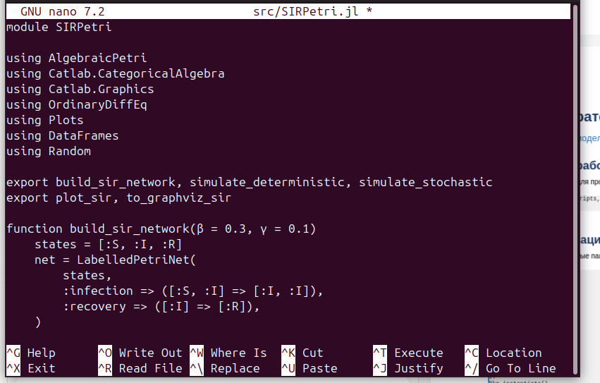
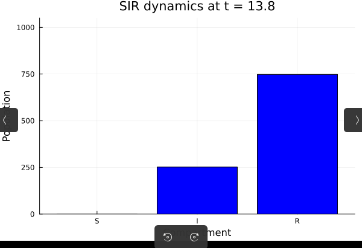
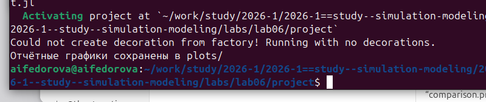

---
author:
  name: Федорова Анжелика Игоревна
title: "Лабораторная работа №6: Реализация основных моделей в подходе сетей Петри"
subtitle: Модель эпидемии SIR на основе формализма сетей Петри
date: today
date-format: "YYYY-MM-DD"
format:
  beamer:
    slide_level: 2
    aspectratio: 169
    section-titles: true
    theme: metropolis
  revealjs:
    slide-level: 2
    theme: moon
    transition: slide
---

# Вводная часть

## Цель работы

Реализовать модель эпидемии SIR с использованием подхода сетей Петри,
выполнить детерминированную и стохастическую симуляции, провести
параметрические эксперименты и исследовать поведение системы.

## Задачи

- Создать структуру проекта с использованием DrWatson
- Установить необходимые пакеты (`AlgebraicPetri.jl`, `OrdinaryDiffEq`, `Plots`, …)
- Реализовать модуль `SIRPetri.jl` с детерминированной и стохастической симуляциями
- Выполнить базовый прогон модели и сохранить результаты
- Провести сканирование параметра β
- Создать анимацию динамики эпидемии
- Построить сравнительные графики для итогового отчёта

# Реализация модели

## Описание модели SIR

- **S** (Susceptible) — восприимчивые, могут заразиться
- **I** (Infectious) — инфицированные, заражают других и выздоравливают
- **R** (Recovered) — выздоровевшие, больше не участвуют в эпидемии

Сеть Петри содержит два перехода:

- `infection`: $S + I \to I + I$ (скорость $\beta$)
- `recovery`: $I \to R$ (скорость $\gamma$)

Начальная маркировка: $S_0 = 990$, $I_0 = 10$, $R_0 = 0$

## Реализация — файл src/SIRPetri.jl

## Функции модуля

| Функция | Назначение |
|---|---|
| `build_sir_network(β, γ)` | Строит сеть Петри, возвращает маркировку |
| `simulate_deterministic(...)` | ОДУ-симуляция (метод Tsit5) |
| `simulate_stochastic(...)` | Алгоритм Гиллеспи |
| `plot_sir(df)` | График динамики S, I, R |
| `to_graphviz_sir(net)` | Визуализация сети Петри |

## Стохастическая симуляция (алгоритм Гиллеспи)

На каждом шаге вычисляются пропускные способности:

$$a_{inf} = \beta \cdot S \cdot I, \quad a_{rec} = \gamma \cdot I$$

Время до следующего события:

$$\Delta t = -\frac{\ln(\xi_1)}{a_0}, \quad a_0 = a_{inf} + a_{rec}$$

Событие выбирается случайно с вероятностью, пропорциональной его пропускной способности.

# Базовый прогон

## Запуск и компиляция зависимостей

## Параметры базового прогона

- $\beta = 0.3$ — коэффициент заражения
- $\gamma = 0.1$ — коэффициент выздоровления
- $t_{max} = 100.0$ — время симуляции
- `Random.seed!(123)` — зерно для воспроизводимости

Выходные данные:

- `data/sir_det.csv`, `data/sir_stoch.csv`
- `plots/sir_det_dynamics.png`, `plots/sir_stoch_dynamics.png`

## Просмотр данных — sir_det.csv

## Просмотр графика в файловом менеджере

# Результаты симуляций

## Детерминированная динамика SIR

{width=85%}

## Стохастическая динамика SIR

{width=85%}

## Сравнение подходов

- **Детерминированная** симуляция: гладкая усреднённая траектория, чёткий пик
- **Стохастическая** симуляция: случайные флуктуации, при малом $I_0$ траектория может существенно отличаться
- При большом начальном числе восприимчивых (990) обе траектории близки

# Сканирование параметра β

## Эксперимент: чувствительность к β

Для каждого $\beta \in [0.1;\, 0.8]$ с шагом $0.05$ запускается детерминированная симуляция ($\gamma = 0.1$ фиксирован).

Вычисляются:

- `peak_I` — максимальное число инфицированных
- `final_R` — конечное число выздоровевших

Результат сохраняется в `data/sir_scan.csv` и `plots/sir_scan.png`.

## Зависимость пика I и final R от β

{width=85%}

## Анализ сканирования

- `final_R` ≈ 1000 при всех β — вся популяция охватывается эпидемией
- `peak_I` незначительно снижается с ростом β: быстрое распространение «сжигает» популяцию быстрее
- Демонстрируется пороговое явление, характерное для модели SIR

# Анимация динамики

Столбчатая диаграмма по компартментам S, I, R обновляется на каждом шаге.

## Анимация — момент пика (t ≈ 13.8)

{width=65%}

- S почти равен нулю, I на максимуме, R активно растёт
- Волна инфекции прошла через популяцию

# Итоговый отчёт

## Формирование сравнительных графиков

## Сравнение детерминированной и стохастической I(t)

{width=85%}

## Чувствительность: пик I от β

{width=85%}

## Завершение скрипта отчёта

# Результаты

## Общий анализ

- **Корректная динамика** — классический профиль SIR: рост, пик, спад I; монотонный рост R
- **Различие подходов** — детерминированная и стохастическая симуляции дают близкие результаты при большой популяции, но расходятся при малом $I_0$
- **Устойчивость к β** — при любом $\beta$ из исследованного диапазона эпидемия охватывает всю популяцию
- **Расширяемость** — формализм сетей Петри легко расширяется (SEIR, SIRS и др.)

# Выводы

## Итоги работы

::: incremental

- Реализован модуль `SIRPetri.jl` с детерминированной (Tsit5) и стохастической (Гиллеспи) симуляциями
- Выполнен базовый прогон: результаты сохранены в CSV и PNG
- Проведено сканирование параметра $\beta$: исследована чувствительность пика эпидемии
- Создана GIF-анимация динамики распределения по компартментам
- Построены сравнительные графики для итогового отчёта
- Подтверждено пороговое явление и различие детерминированного и стохастического подходов

:::

## Список литературы

1. AlgebraicPetri.jl — Julia package for Petri net modeling. \url{https://algebraicjulia.github.io/AlgebraicPetri.jl}
2. Gillespie D.T. *Exact stochastic simulation of coupled chemical reactions*. J. Phys. Chem., 1977.
3. Datseris G. et al. *Agents.jl: a performant and feature-full agent-based modeling software of minimal code complexity*. JASSS, 2022.
4. DrWatson.jl — Scientific project assistant for Julia. \url{https://juliadynamics.github.io/DrWatson.jl}
