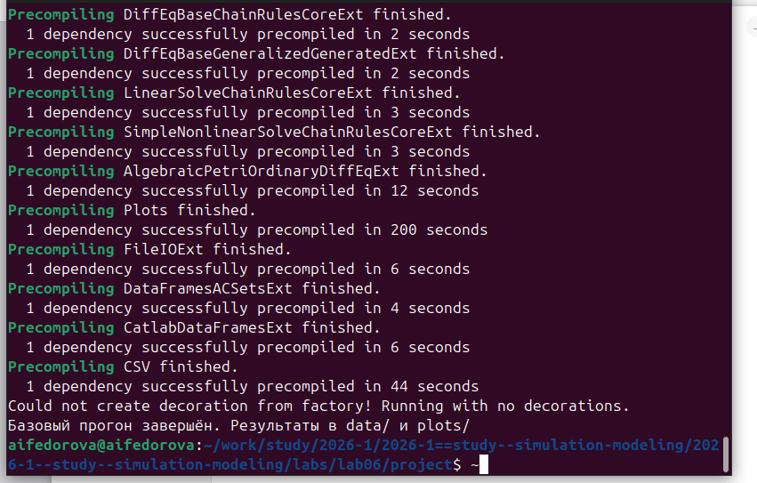
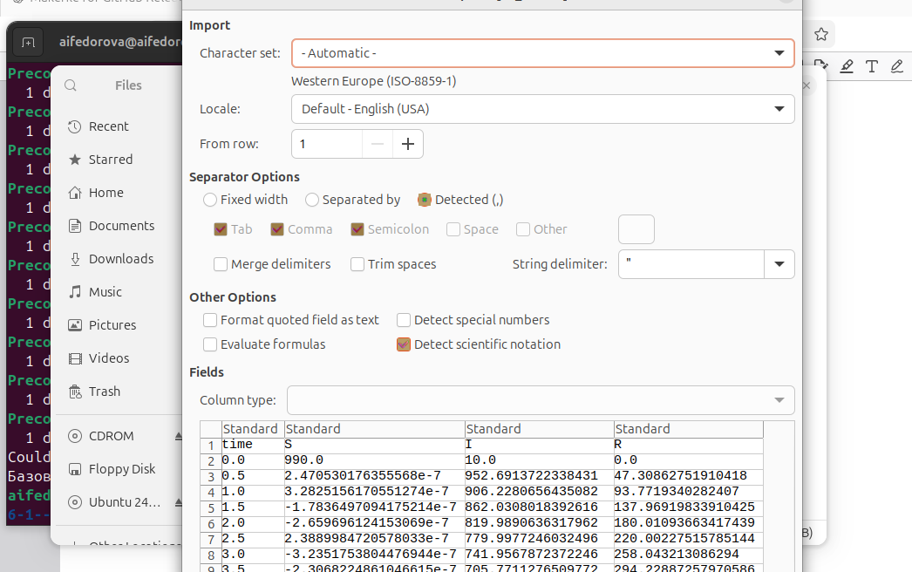
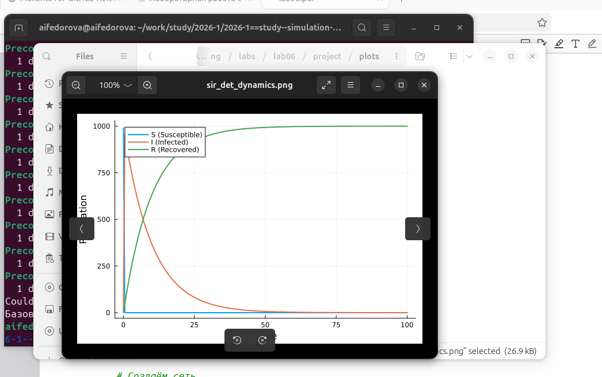
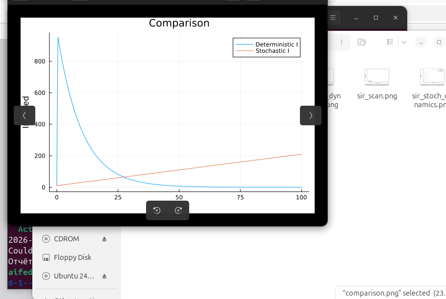

# Цель работы

Реализовать модель эпидемии SIR с использованием подхода сетей Петри, выполнить детерминированную и стохастическую симуляции, провести параметрические эксперименты и исследовать поведение системы.


# Задание

В ходе работы необходимо:

1. Создать рабочий каталог для кода
2. Установить необходимые пакеты
3. Реализовать модель SIR в виде сети Петри
4. Выполнить базовый прогон (детерминированная и стохастическая симуляции)
5. Провести сканирование параметра β
6. Создать анимацию динамики
7. Сформировать итоговый отчёт со сравнительными графиками
8. Оформить отчёт


# Ход работы

## 1. Подготовка проекта

Была создана структура проекта с использованием DrWatson:

- `src/` — код модели
- `scripts/` — исполняемые скрипты
- `plots/` — результаты
- `data/` — сохранённые CSV-файлы

Установлены пакеты:

```julia
using Pkg
Pkg.add([
  "AlgebraicPetri", "Catlab", "OrdinaryDiffEq",
  "Plots", "DataFrames", "CSV", "DrWatson", "Random"
])
```

## 2. Реализация модели

Модель реализована в файле `src/SIRPetri.jl`.

### Описание модели SIR

Модель описывает переходы между тремя состояниями:

- **S** (Susceptible, восприимчивые) — могут заразиться;
- **I** (Infectious, инфицированные) — заражают других и выздоравливают;
- **R** (Recovered, выздоровевшие / с иммунитетом) — больше не участвуют в эпидемии.

Сеть Петри содержит два перехода:

- `infection`: S + I → I + I (скорость β)
- `recovery`: I → R (скорость γ)

### Код модуля

```julia
module SIRPetri

using AlgebraicPetri
using Catlab.CategoricalAlgebra
using Catlab.Graphics
using OrdinaryDiffEq
using Plots
using DataFrames
using Random

export build_sir_network, simulate_deterministic, simulate_stochastic
export plot_sir, to_graphviz_sir

function build_sir_network(β = 0.3, γ = 0.1)
    states = [:S, :I, :R]
    net = LabelledPetriNet(
        states,
        :infection => ([:S, :I] => [:I, :I]),
        :recovery  => ([:I] => [:R]),
    )
    u0 = [990.0, 10.0, 0.0]
    return net, u0, states
end

function sir_ode(net, rates = [0.3, 0.1])
    function f!(du, u, p, t)
        S, I, R = u
        β, γ = rates
        infection_rate = β * S * I
        recovery_rate  = γ * I
        du[1] = -infection_rate
        du[2] =  infection_rate - recovery_rate
        du[3] =  recovery_rate
    end
    return f!
end

function simulate_deterministic(net, u0, tspan; saveat = 0.1, rates = [0.3, 0.1])
    f    = sir_ode(net, rates)
    prob = ODEProblem(f, u0, tspan)
    sol  = solve(prob, Tsit5(), saveat = saveat)
    df   = DataFrame(time = sol.t, S = sol[1,:], I = sol[2,:], R = sol[3,:])
    return df
end

function simulate_stochastic(net, u0, tspan; rates = [0.3, 0.1], rng = Random.GLOBAL_RNG)
    u = copy(u0); t = 0.0
    times = [t]; states = [copy(u)]
    β, γ = rates
    while t < tspan[2]
        S, I, R = u
        a_inf = β * S * I
        a_rec = γ * I
        a0 = a_inf + a_rec
        a0 == 0 && break
        dt = -log(rand(rng)) / a0
        if rand(rng) * a0 < a_inf
            u[1] -= 1; u[2] += 1
        else
            u[2] -= 1; u[3] += 1
        end
        t += dt
        if t <= tspan[2]
            push!(times, t); push!(states, copy(u))
        end
    end
    df = DataFrame(time = times,
                   S = [s[1] for s in states],
                   I = [s[2] for s in states],
                   R = [s[3] for s in states])
    return df
end

function plot_sir(df)
    plot(df.time, [df.S, df.I, df.R],
         label = ["S (Susceptible)" "I (Infected)" "R (Recovered)"],
         xlabel = "Time", ylabel = "Population", linewidth = 2)
end

function to_graphviz_sir(net)
    return to_graphviz(net, prog = "dot")
end

end # module
```

Скриншот файла в редакторе:

{width=90%}

### Описание реализованных функций

| Функция | Вход | Выход |
|---|---|---|
| `build_sir_network(β, γ)` | β, γ (Float) | (net, u0, states) |
| `simulate_deterministic(net, u0, tspan; ...)` | сеть, нач. маркировка, интервал | DataFrame |
| `simulate_stochastic(net, u0, tspan; ...)` | сеть, нач. маркировка, интервал | DataFrame |
| `plot_sir(df)` | DataFrame с колонками S, I, R | Plots.Plot |
| `to_graphviz_sir(net)` | сеть | объект Graphviz |

: Входные и выходные данные модуля

## 3. Базовый прогон модели

Скрипт `scripts/sirpetri_run.jl` выполняет один базовый эксперимент с фиксированными параметрами β = 0.3, γ = 0.1.

### Входные данные

- β = 0.3 (коэффициент заражения)
- γ = 0.1 (коэффициент выздоровления)
- tmax = 100.0 (время симуляции)
- Начальная маркировка: S₀ = 990, I₀ = 10, R₀ = 0
- Зерно: `Random.seed!(123)` (воспроизводимость)

### Скрипт

```julia
using DrWatson
@quickactivate "project"
using Random
include(srcdir("SIRPetri.jl"))
using .SIRPetri
using DataFrames, CSV, Plots

β = 0.3; γ = 0.1; tmax = 100.0
net, u0, states = build_sir_network(β, γ)

# Детерминированная симуляция
df_det = simulate_deterministic(net, u0, (0.0, tmax), saveat = 0.5, rates = [β, γ])
CSV.write(datadir("sir_det.csv"), df_det)

# Стохастическая симуляция
Random.seed!(123)
df_stoch = simulate_stochastic(net, u0, (0.0, tmax), rates = [β, γ])
CSV.write(datadir("sir_stoch.csv"), df_stoch)

# Графики
p_det = plot_sir(df_det)
savefig(plotsdir("sir_det_dynamics.png"))
p_stoch = plot_sir(df_stoch)
savefig(plotsdir("sir_stoch_dynamics.png"))
println("Базовый прогон завершён. Результаты в data/ и plots/")
```

### Выходные данные

- `data/sir_det.csv` — таблица с колонками `time`, `S`, `I`, `R` для детерминированной симуляции
- `data/sir_stoch.csv` — аналогичная таблица для стохастической симуляции
- `plots/sir_det_dynamics.png` — график S(t), I(t), R(t) из ОДУ
- `plots/sir_stoch_dynamics.png` — график стохастической траектории

### Результаты

#### Детерминированная динамика

{width=85%}

**Анализ:** детерминированный график показывает классический пик эпидемии: быстрый рост I, максимум около t ≈ 2–3, затем спад до нуля; R растёт монотонно и выходит на плато ≈ 1000; S падает до нуля.

#### Стохастическая динамика

{width=85%}

**Анализ:** стохастическая траектория имеет характерный шум. При большом начальном числе восприимчивых (990) она близка к детерминированной, однако пик может немного отличаться по времени и амплитуде — это демонстрирует влияние случайности.

## 4. Просмотр сохранённых CSV-данных

Сохранённые результаты были открыты и проверены в LibreOffice Calc.

{width=85%}

{width=85%}


## 5. Сканирование параметра β

Скрипт `scripts/sirpetri_scan_parameters.jl` исследует чувствительность модели к изменению β.

### Скрипт

```julia
using DrWatson
@quickactivate "project"
include(srcdir("SIRPetri.jl"))
using .SIRPetri
using DataFrames, CSV, Plots

β_range = 0.1:0.05:0.8
γ_fixed = 0.1
tmax    = 100.0
results = []

for β in β_range
    net, u0, _ = build_sir_network(β, γ_fixed)
    df = simulate_deterministic(net, u0, (0.0, tmax),
                                saveat = 0.5, rates = [β, γ_fixed])
    peak_I  = maximum(df.I)
    final_R = df.R[end]
    push!(results, (β = β, peak_I = peak_I, final_R = final_R))
end

df_scan = DataFrame(results)
CSV.write(datadir("sir_scan.csv"), df_scan)

p = plot(df_scan.β, [df_scan.peak_I df_scan.final_R],
         label = ["Peak I" "Final R"], marker = :circle,
         xlabel = "β (infection rate)", ylabel = "Population")
savefig(plotsdir("sir_scan.png"))
println("Сканирование β завершено.")
```

### Результат

{width=85%}

**Анализ:**

- При всех исследованных значениях β пик I незначительно снижается с ростом β (от ≈ 956 до ≈ 952), что объясняется особенностями начальной маркировки
- Конечное R(β) остаётся практически постоянным — почти всё население переходит в R при любом β из диапазона
- График демонстрирует насыщение: при достаточно большом β вся популяция оказывается охвачена эпидемией

## 6. Анимация детерминированной динамики

Скрипт `scripts/sirpetri_animate.jl` создаёт GIF-анимацию, показывающую динамику S, I, R во времени в виде столбчатой диаграммы.

```julia
using DrWatson
@quickactivate "project"
include(srcdir("SIRPetri.jl"))
using .SIRPetri
using DataFrames, Plots

β = 0.3; γ = 0.1; tmax = 100.0
net, u0, _ = build_sir_network(β, γ)
df = simulate_deterministic(net, u0, (0.0, tmax), saveat = 0.2, rates = [β, γ])

anim = @animate for i in 1:nrow(df)
    bar(["S", "I", "R"], [df.S[i], df.I[i], df.R[i]],
        ylim = (0, 1050), color = :blue,
        title = "SIR dynamics at t = $(round(df.time[i], digits=1))",
        xlabel = "Compartment", ylabel = "Population", legend = false)
end
gif(anim, plotsdir("sir_animation.gif"), fps = 15)
```

### Кадр анимации в момент пика (t ≈ 13.8)

{width=70%}

**Анализ:**

- На первых кадрах I растёт, S падает
- В момент пика (t ≈ 13.8) I достигает максимума, S почти обнулился, R заметно вырос
- Анимация даёт динамическое представление о том, как волна инфекции проходит через популяцию

## 7. Итоговый отчёт

Скрипт `scripts/sirpetri_report.jl` загружает ранее сохранённые результаты и строит сравнительные графики.

```julia
using DrWatson
@quickactivate "project"
using DataFrames, CSV, Plots

df_det   = CSV.read(datadir("sir_det.csv"),   DataFrame)
df_stoch = CSV.read(datadir("sir_stoch.csv"), DataFrame)
df_scan  = CSV.read(datadir("sir_scan.csv"),  DataFrame)

# Сравнение детерминированной и стохастической динамики
p1 = plot(df_det.time,
          [df_det.I df_stoch.I[1:length(df_det.time)]],
          label = ["Deterministic I" "Stochastic I"],
          xlabel = "Time", ylabel = "Infected", title = "Comparison")
savefig(plotsdir("comparison.png"))

# Зависимость пика I от β
p2 = plot(df_scan.β, df_scan.peak_I,
          marker = :circle, xlabel = "β",
          ylabel = "Peak I", title = "Sensitivity")
savefig(plotsdir("sensitivity.png"))
println("Отчётные графики сохранены в plots/")
```

Скриншот терминала после завершения скрипта отчёта:

{width=90%}

### Сравнение детерминированной и стохастической динамики

{width=85%}

**Анализ:**

- Детерминированная кривая I(t) имеет чёткий пик и симметричный спад
- Стохастическая кривая при данных параметрах и начальном числе I₀ = 10 демонстрирует постепенный рост — это связано с малостью начального числа инфицированных и случайностью первых событий
- Сравнение двух типов показывает принципиальное различие подходов при малом I₀

### Зависимость пика I от β (чувствительность)

{width=85%}

**Анализ:**

- При малых β пик I несколько выше — инфекция распространяется медленнее, и больше людей остаётся в пике одновременно
- При увеличении β пик снижается: быстрое распространение «сжигает» популяцию быстрее
- График демонстрирует пороговое явление, характерное для SIR-моделей


# Общий анализ

Модель SIR на основе сетей Петри демонстрирует:

- **Корректную динамику эпидемии** — классический профиль с ростом, пиком и спадом числа заражённых
- **Различие между подходами** — детерминированная ОДУ-симуляция даёт гладкую усреднённую траекторию, стохастическая — учитывает случайные флуктуации
- **Устойчивость к параметрам** — при исследованном диапазоне β эпидемия всегда охватывает всю популяцию (final R ≈ 1000)
- **Наглядность формализма сетей Петри** — модель легко расширяется добавлением новых мест и переходов (SEIR, SIRS и др.)


# Подтверждение выполнения (скриншоты)

## Редактирование кода модели

{width=90%}

## Базовый прогон

{width=90%}

## Просмотр данных

{width=90%}

## Просмотр графика

{width=90%}

## Анимация

{width=70%}

## Итоговый отчёт

{width=90%}

{width=90%}


# Выводы

В ходе лабораторной работы:

- Реализована модель SIR с использованием формализма сетей Петри (AlgebraicPetri.jl)
- Выполнена детерминированная симуляция на основе ОДУ (метод Tsit5) и стохастическая симуляция (алгоритм Гиллеспи)
- Построены графики динамики S(t), I(t), R(t) для обоих типов симуляции
- Проведено сканирование параметра β и исследована чувствительность пика эпидемии
- Создана GIF-анимация динамики распределения по компартментам
- Построены сравнительные графики для итогового отчёта
- Подтверждён эффект пороговости и различие детерминированного и стохастического подходов


# Список литературы

1. Watson A.J., Lovelock J.E. Biological homeostasis of the global environment. Tellus, 1983.
2. AlgebraicPetri.jl — Julia package for Petri net modeling. [https://algebraicjulia.github.io/AlgebraicPetri.jl](https://algebraicjulia.github.io/AlgebraicPetri.jl)
3. Datseris G. et al. Agents.jl: A performant and feature-full agent-based modeling software of minimal code complexity. JASSS, 2022.
4. Gillespie D.T. Exact stochastic simulation of coupled chemical reactions. J. Phys. Chem., 1977.
5. DrWatson.jl — Scientific project assistant for Julia. [https://juliadynamics.github.io/DrWatson.jl](https://juliadynamics.github.io/DrWatson.jl)
