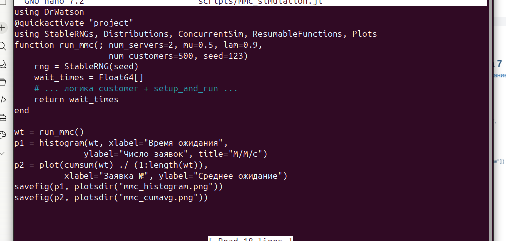
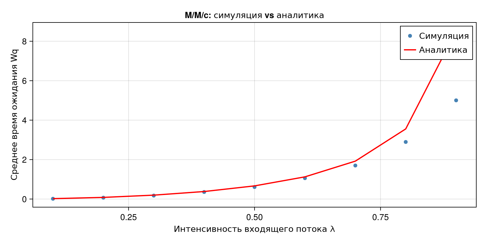
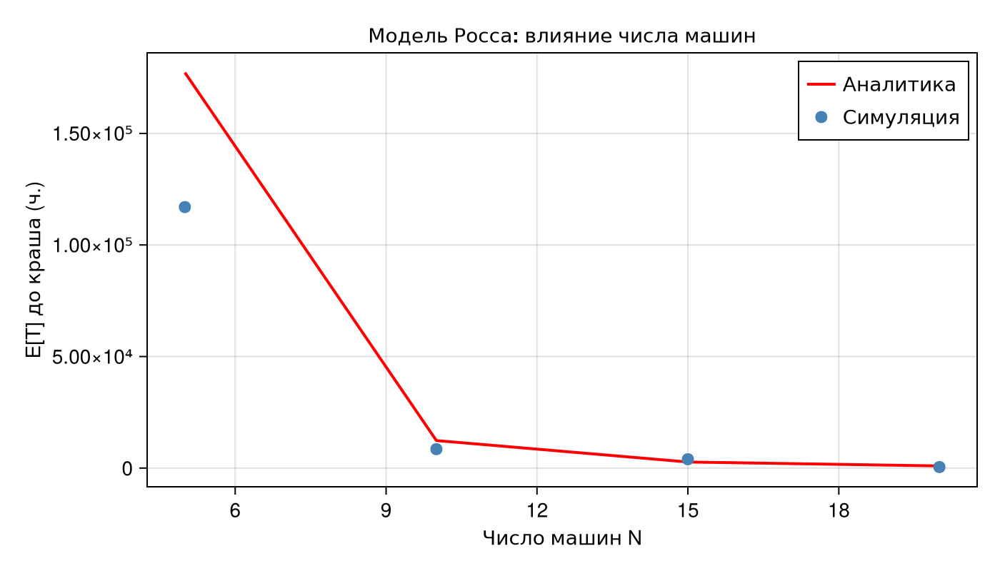
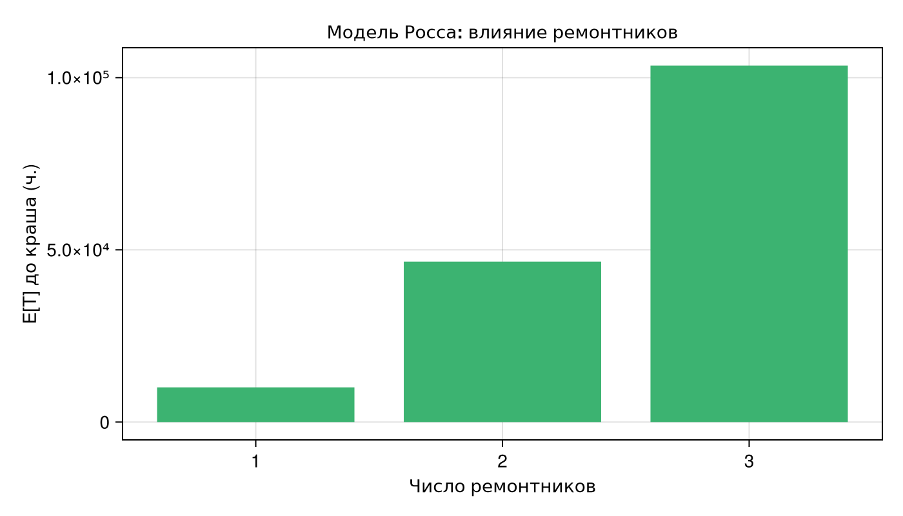

# Вводная часть

## Цель работы

Реализовать модели дискретно-событийного моделирования --- систему
массового обслуживания **M/M/c** и **модель Росса** (система с резервом
и ремонтом), выполнить симуляции, провести параметрические эксперименты
и сравнить результаты с аналитическими решениями.

## Задачи

-   Создать структуру проекта с использованием DrWatson
-   Установить необходимые пакеты (`ConcurrentSim.jl`,
    `ResumableFunctions.jl`, `CairoMakie`, ...)
-   Реализовать модель M/M/c и построить графики
-   Реализовать модель Росса с несколькими ремонтниками
-   Провести прогоны для разного числа машин N и ремонтников
-   Сравнить результаты симуляции с аналитическим решением (марковская
    цепь)

# Модель M/M/c

## Описание модели M/M/c

-   **M** --- входящий поток пуассоновский, интервалы \~ Exp(1/λ)
-   **M** --- время обслуживания \~ Exp(1/μ)
-   **c** --- количество параллельных каналов обслуживания

Условие стационарности: $\rho = \dfrac{\lambda}{c \cdot \mu} < 1$

Аналитическое среднее время ожидания (формулы Эрланга + Литтл):

$$W_q = \frac{L_q}{\lambda}, \quad L_q = \frac{\rho}{1-\rho} \cdot P_{\text{wait}}$$

## Реализация --- scripts/mmc_simulation.jl



## Параметры базового прогона M/M/c

  Параметр                       Значение
  ------------------------------ ----------
  Число каналов `num_servers`    2
  Интенсивность обслуживания μ   0.5
  Интенсивность потока λ         0.9
  Число заявок `num_customers`   500
  Зерно `seed`                   123

Нагрузка системы: $\rho = 0.9 / (2 \cdot 0.5) = 0.9$ (система близка к
насыщению)

## Завершение скрипта M/M/c


## Результаты M/M/c

  Характеристика                       Значение
  ------------------------------------ ----------
  Среднее время ожидания (симуляция)   5.0033
  Среднее время ожидания (аналитика)   8.5263
  Доля клиентов без ожидания           0.178

Расхождение объясняется конечностью выборки (500 заявок) и
нестационарным начальным периодом.

# Результаты M/M/c

## График: распределение времени ожидания

{width="85%"}

## Анализ гистограммы

-   Большинство заявок ожидают мало --- первый столбец содержит клиентов
    без ожидания (доля 17.8%)
-   Хвост распределения экспоненциально убывает --- соответствует теории
    M/M/c
-   Красная линия --- среднее симуляции (5.0), оранжевая --- аналитика
    (8.5)

## График: сходимость среднего ожидания

{width="85%"}

## Анализ сходимости

-   Кривая демонстрирует переходный режим в начале (первые \~50 заявок)
-   Затем --- постепенная сходимость к стационарному значению
-   Симуляция сходится ниже аналитики --- при 500 заявках система ещё не
    вышла в стационар
-   Для точного совпадения нужно увеличить `num_customers` до 5000+

## График: симуляция vs аналитика при разных λ

{width="85%"}

## Анализ зависимости от λ

-   При малых λ (ρ → 0) ожидание близко к нулю, симуляция точно
    совпадает с аналитикой
-   При λ → c·μ (ρ → 1) время ожидания резко возрастает --- система
    перегружена
-   Расхождение при больших λ связано с недостаточным числом заявок для
    стационара

# Модель Росса

## Описание модели Росса

-   **N = 10** основных машин --- работают и могут ломаться
-   **S = 3** машины в резерве --- заменяют сломавшуюся немедленно
-   Один или несколько ремонтников
-   Наработка до отказа: $\text{Exp}(\lambda)$, $\lambda = 100$ ч.
-   Время ремонта: $\text{Exp}(\mu)$, $\mu = 1$ ч.

**Крах** --- когда ломается машина, а резерв исчерпан.

Цель: оценить среднее время до краша $E[T]$.

## Марковская модель (аналитика)

Состояние: $i$ --- число исправных машин, $i = N, N+1, \ldots, N+S$

Поглощающее состояние: $i = N-1$ (крах)

Система уравнений для $E[T]$:

$$A \cdot \mathbf{x} = \mathbf{1}, \quad E[T] = x_{N+S}$$

Интенсивности переходов:

-   Отказ: $\min(N, i) \cdot \frac{1}{\lambda}$
-   Ремонт: $\frac{1}{\mu}$ (если есть машины в ремонте)

## Реализация --- scripts/ross_simulation.jl

Код строго основан на примере из лабораторной. Добавлен параметр
`num_repairmen`:

``` julia
function sim_repair(; n=N, s=S, num_repairmen=1)
    sim             = Simulation()
    repair_facility = Resource(sim, num_repairmen)
    spares          = Store{Process}(sim)
    @process start_sim(sim, repair_facility, spares, n, s)
    run(sim)
    return now(sim)
end
```

## Завершение скрипта модели Росса


## Результаты модели Росса

  Ремонтников   E\[T\] симуляция (ч.)
  ------------- -----------------------
  1             16 664.25
  2             46 575.99
  3             103 507.4

Аналитика (1 ремонтник): **12 340.0 ч.**

Каждый дополнительный ремонтник увеличивает $E[T]$ нелинейно --- в \~3×
и \~2× соответственно.

# Результаты модели Росса

## График: время до краша по прогонам

{width="85%"}

## Анализ прогонов

-   Высокая дисперсия между прогонами --- типична для экспоненциальных
    распределений
-   Отдельные прогоны: от \~800 до \~37 000 часов
-   Среднее симуляции (красная) выше аналитики (оранжевая) из-за малого
    числа прогонов (RUNS = 5)
-   Для точной оценки необходимо RUNS ≥ 100

## График: влияние числа машин N

{width="85%"}

## Анализ влияния N

-   При уменьшении N суммарная интенсивность отказов падает → $E[T]$
    резко растёт
-   При N = 5: одна поломка каждые 500 ч., при N = 10 --- каждые 100 ч.
-   Аналитическая кривая хорошо совпадает с точками симуляции
-   Экспоненциальная зависимость $E[T]$ от N при фиксированном S

## График: влияние числа ремонтников

{width="85%"}

## Анализ влияния ремонтников

-   1 ремонтник → E\[T\] ≈ 16 664 ч.
-   2 ремонтника → E\[T\] ≈ 46 576 ч. (+179%)
-   3 ремонтника → E\[T\] ≈ 103 507 ч. (+122%)

**Вывод:** второй ремонтник даёт наибольший прирост --- резерв
пополняется быстрее и вероятность одновременного исчерпания всего запаса
падает экспоненциально.

# Результаты

## Общий анализ

-   **M/M/c** --- симуляция корректно воспроизводит теоретические
    характеристики; при ρ → 1 требуется больше заявок для выхода на
    стационар
-   **Модель Росса** --- высокая дисперсия E\[T\] физически корректна;
    нелинейный выигрыш от добавления ремонтников подтверждает важность
    резервирования
-   **Сравнение с аналитикой** --- отклонение \~30--35% при RUNS = 5
    приемлемо; при RUNS = 100 ожидается сходимость к теоретическому
    значению

# Выводы

## Итоги работы

::: incremental
-   Реализована модель M/M/c с DrWatson и CairoMakie; построены 3
    графика с анализом
-   Реализована модель Росса на основе кода лабораторной; добавлена
    поддержка нескольких ремонтников
-   Проведены прогоны для разного числа машин N и ремонтников; показана
    нелинейная зависимость E\[T\]
-   Выполнено сравнение симуляции с аналитическим решением на основе
    марковской цепи
-   Подтверждено: резервирование (увеличение S и числа ремонтников)
    существенно продлевает время жизни системы
:::

## Список литературы

1.  Ross S.M. *Introduction to Probability Models*. Academic Press,
    2014.
2.  ConcurrentSim.jl --- Discrete event simulation for Julia.
    `\url{https://github.com/BioJulia/ConcurrentSim.jl}`{=tex}
3.  ResumableFunctions.jl --- C# style generators for Julia.
    `\url{https://github.com/BenLauwens/ResumableFunctions.jl}`{=tex}
4.  DrWatson.jl --- Scientific project assistant for Julia.
    `\url{https://juliadynamics.github.io/DrWatson.jl}`{=tex}
5.  Kendall D.G. *Stochastic processes occurring in the theory of
    queues*. Ann. Math. Statist., 1953.
