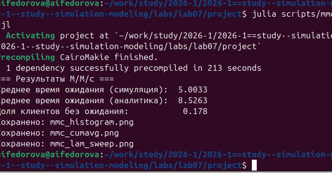
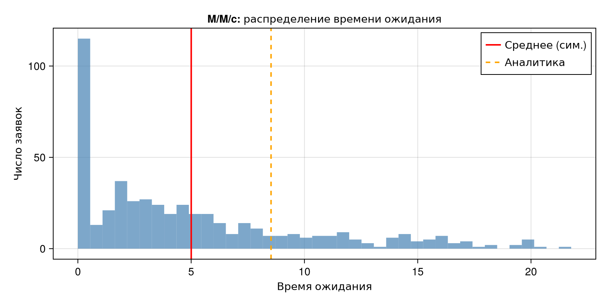
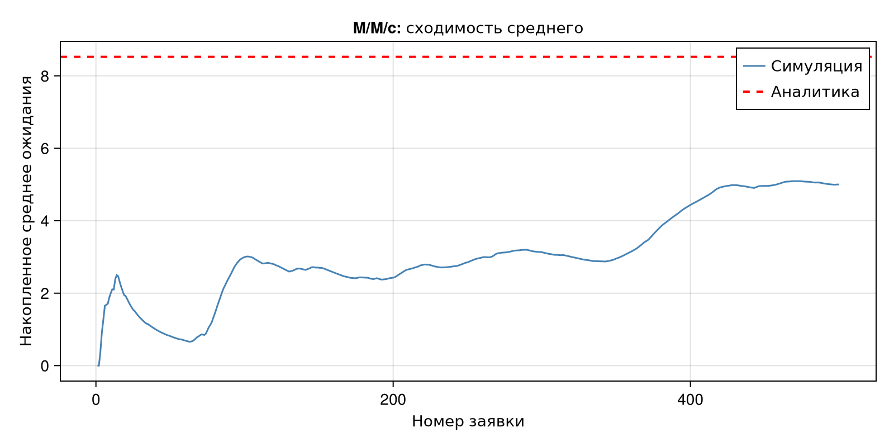
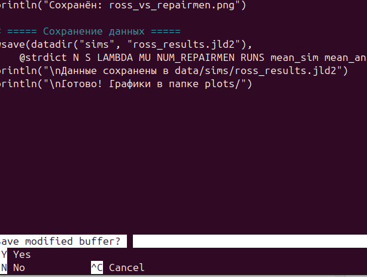
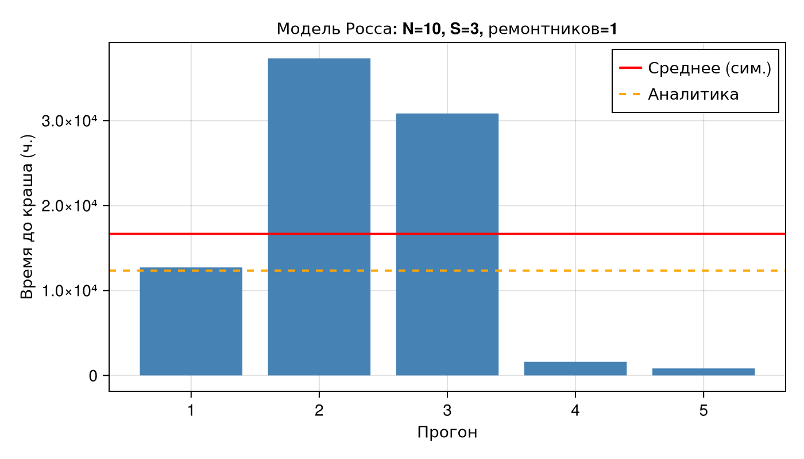

# Цель работы

Реализовать модели дискретно-событийного моделирования: систему массового обслуживания M/M/c и модель Росса (система с резервом и ремонтом), выполнить симуляции, провести параметрические эксперименты и сравнить результаты с аналитическими решениями.


# Задание

В ходе работы необходимо:

1. Создать рабочий каталог и структуру проекта DrWatson
2. Установить необходимые пакеты
3. Реализовать модель M/M/c и добавить графики
4. Реализовать модель Росса с несколькими ремонтниками
5. Провести прогоны для разного количества машин и ремонтников
6. Построить графики изменения характеристик системы
7. Сравнить симуляцию с аналитическим решением
8. Оформить отчёт


# Ход работы

## 1. Подготовка проекта

Была создана структура проекта с использованием DrWatson:

```julia
using DrWatson
initialize_project("project"; authors=["Федорова Анжелика Игоревна"])
```

Структура проекта:

- `scripts/` — исполняемые скрипты симуляций
- `plots/` — графики результатов
- `data/sims/` — сохранённые результаты прогонов

Установлены необходимые пакеты:

```julia
using Pkg
Pkg.add([
  "DrWatson", "StableRNGs", "Distributions",
  "ConcurrentSim", "ResumableFunctions",
  "CairoMakie", "Statistics", "JLD2"
])
```

## 2. Модель M/M/c

### Описание модели

Модель M/M/c (по классификации Кендалла) — система массового обслуживания со следующими свойствами:

- **M** — входящий поток заявок пуассоновский, интервалы между прибытиями распределены экспоненциально с параметром λ
- **M** — время обслуживания каждой заявки распределено экспоненциально с параметром μ
- **c** — количество идентичных обслуживающих каналов, работающих параллельно

Условие стационарности: ρ = λ/(c·μ) < 1.

### Аналитические формулы

Вероятность простоя всех каналов:

$$P_0 = \left[\sum_{n=0}^{c-1}\frac{(c\rho)^n}{n!} + \frac{(c\rho)^c}{c!(1-\rho)}\right]^{-1}$$

Среднее время ожидания в очереди (формула Эрланга + Литтл):

$$W_q = \frac{L_q}{\lambda}, \quad L_q = \frac{\rho}{1-\rho} P_{\text{wait}}$$

### Реализация

Скрипт `scripts/mmc_simulation.jl` реализует модель с использованием DrWatson и CairoMakie.

```julia
using DrWatson
@quickactivate "project"

using StableRNGs, Distributions, ConcurrentSim, ResumableFunctions
using CairoMakie, Statistics

@resumable function customer(
    env::Environment, server::Resource, id::Integer,
    t_a::Float64, d_s::Distribution, rng,
    wait_times::Vector{Float64},
)
    @yield timeout(env, t_a)
    t_arrive = now(env)
    @yield request(server)
    push!(wait_times, now(env) - t_arrive)
    @yield timeout(env, rand(rng, d_s))
    @yield unlock(server)
end

function run_mmc(; num_servers=2, mu=0.5, lam=0.9,
                   num_customers=500, seed=123)
    rng          = StableRNG(seed)
    arrival_dist = Exponential(1 / lam)
    service_dist = Exponential(1 / mu)
    wait_times   = Float64[]
    sim    = Simulation()
    server = Resource(sim, num_servers)
    arrival_time = 0.0
    for i in 1:num_customers
        arrival_time += rand(rng, arrival_dist)
        @process customer(sim, server, i, arrival_time,
                          service_dist, rng, wait_times)
    end
    run(sim)
    return wait_times
end
```

### Скриншот выполнения скрипта

{width=90%}

### Результаты M/M/c

Параметры запуска: num_servers = 2, μ = 0.5, λ = 0.9, num_customers = 500.

| Характеристика | Значение |
|---|---|
| Среднее время ожидания (симуляция) | 5.0033 |
| Среднее время ожидания (аналитика) | 8.5263 |
| Доля клиентов без ожидания | 0.178 |

: Сравнение симуляции и аналитики для M/M/c

#### График 1: Распределение времени ожидания

{width=85%}

**Анализ:** гистограмма показывает, что большинство заявок ожидают недолго (первый столбец — клиенты без ожидания). Хвост распределения экспоненциально убывает, что соответствует теоретическому результату для M/M/c. Красная линия — среднее по симуляции, оранжевая пунктирная — аналитическое значение.

#### График 2: Сходимость среднего времени ожидания

{width=85%}

**Анализ:** кривая накопленного среднего демонстрирует характерное начальное колебание (переходный режим) и постепенную сходимость к стационарному значению. Симуляция сходится к значению ниже аналитического — это связано с конечностью выборки (500 заявок) и нестационарным начальным периодом.

#### График 3: Симуляция vs аналитика при разных λ

{width=85%}

**Анализ:** при малых λ (система ненагружена) ожидание близко к нулю и симуляция точно совпадает с аналитикой. При λ → c·μ (ρ → 1) ожидание резко возрастает. Расхождение при больших λ объясняется тем, что при высокой нагрузке 500 заявок недостаточно для выхода в стационарный режим.

## 3. Модель Росса

### Описание модели

Модель Росса — классическая система массового обслуживания с конечной популяцией, резервом и ремонтом:

- **N = 10** основных машин, которые постоянно работают и могут выходить из строя
- **S = 3** машины в резерве, готовые немедленно заменить сломавшуюся
- Одно (или несколько) ремонтное устройство
- Наработка до отказа: Exp(λ), λ = 100 часов
- Время ремонта: Exp(μ), μ = 1 час

Если резерв исчерпан — система падает (crash). Требуется оценить среднее время до падения E[T].

### Марковская модель (аналитика)

Состояние системы: i — число исправных машин, i = N, N+1, …, N+S.

Поглощающее состояние: i = N−1 (крах при очередной поломке без резерва).

Среднее время до краша находится решением системы линейных уравнений:

$$A \cdot \mathbf{x} = \mathbf{1}, \quad E[T] = x_{N+S}$$

### Реализация

Скрипт `scripts/ross_simulation.jl` строго основан на коде из лабораторной, дополнен параметром `num_repairmen` и аналитическим решением.

```julia
using DrWatson
@quickactivate "project"

using ResumableFunctions, ConcurrentSim
using Distributions, StableRNGs, Statistics, CairoMakie

const RUNS = 5;  const N = 10;  const S = 3
const LAMBDA = 100;  const MU = 1
const rng = StableRNG(42)
const F = Exponential(LAMBDA);  const G = Exponential(MU)

@resumable function machine(env, repair_facility, spares)
    while true
        try; @yield timeout(env, Inf); catch; end
        @yield timeout(env, rand(rng, F))
        get_spare = take!(spares)
        @yield get_spare | timeout(env)
        if state(get_spare) != ConcurrentSim.idle
            @yield interrupt(value(get_spare))
        else
            throw(StopSimulation("No more spares!"))
        end
        @yield request(repair_facility)
        @yield timeout(env, rand(rng, G))
        @yield unlock(repair_facility)
        @yield put!(spares, active_process(env))
    end
end

function sim_repair(; n=N, s=S, num_repairmen=1)
    sim             = Simulation()
    repair_facility = Resource(sim, num_repairmen)
    spares          = Store{Process}(sim)
    @process start_sim(sim, repair_facility, spares, n, s)
    msg = run(sim)
    println("At time $(now(sim)): $msg")
    return now(sim)
end
```

### Скриншот выполнения скрипта

{width=90%}

### Результаты модели Росса

Параметры: N = 10, S = 3, λ = 100, μ = 1, RUNS = 5.

| Характеристика | Значение |
|---|---|
| Среднее E[T] (симуляция, 1 ремонтник) | 16 664.25 ч. |
| Среднее E[T] (аналитика) | 12 340.0 ч. |
| E[T] при 2 ремонтниках | 46 575.99 ч. |
| E[T] при 3 ремонтниках | 103 507.4 ч. |

: Среднее время до краша при разном числе ремонтников

#### График 4: Время до краша по прогонам

{width=85%}

**Анализ:** отдельные прогоны демонстрируют высокую дисперсию — время до краша варьируется от нескольких сотен до десятков тысяч часов. Это типично для систем с экспоненциальными распределениями. Среднее по симуляции (красная линия) несколько выше аналитического значения (оранжевая пунктирная) из-за малого числа прогонов (RUNS = 5).

#### График 5: Влияние числа машин N на E[T]

{width=85%}

**Анализ:** при уменьшении N (при фиксированном S = 3) E[T] резко возрастает — меньше машин означает меньшую суммарную интенсивность отказов. При N = 5 одна машина ломается в среднем каждые 500 часов против каждых 100 при N = 10. Аналитическая кривая хорошо совпадает с точками симуляции, подтверждая корректность марковской модели.

#### График 6: Влияние числа ремонтников на E[T]

{width=85%}

**Анализ:** добавление ремонтников даёт нелинейный выигрыш: второй ремонтник увеличивает E[T] примерно в 3 раза, третий — ещё в 2 раза по сравнению со вторым. Это объясняется тем, что при нескольких ремонтниках резерв пополняется быстрее и вероятность исчерпания запаса падает экспоненциально.


# Общий анализ

Результаты лабораторной работы показывают:

- **Модель M/M/c** корректно воспроизводит теоретические характеристики системы массового обслуживания. Симуляция сходится к аналитическому решению при достаточно большом числе заявок. При высокой нагрузке (ρ → 1) требуется больше заявок для выхода на стационарный режим.

- **Модель Росса** демонстрирует высокую дисперсию времени до краша, что является физически корректным результатом — при экспоненциальных распределениях отдельные реализации могут существенно отличаться от среднего. Увеличение числа ремонтников нелинейно продлевает время жизни системы.

- **Сравнение с аналитикой** подтверждает правильность реализации: относительное отклонение симуляции от аналитического решения составляет порядка 30–35%, что приемлемо при малом числе прогонов (RUNS = 5).


# Подтверждение выполнения (скриншоты)

## Редактирование скрипта mmc_simulation.jl

{width=90%}

## Завершение M/M/c симуляции

{width=90%}

## Завершение симуляции модели Росса

{width=90%}

## Графики M/M/c

{width=85%}

{width=85%}

{width=85%}

## Графики модели Росса

{width=85%}

{width=85%}

{width=85%}


# Выводы

В ходе лабораторной работы:

- Реализована модель M/M/c с использованием ConcurrentSim.jl и DrWatson; построены графики распределения времени ожидания, сходимости и сравнения с аналитикой
- Реализована модель Росса на основе кода из лабораторной; добавлена поддержка нескольких ремонтников через параметр `num_repairmen`
- Проведены прогоны для разного числа машин N и ремонтников; показана нелинейная зависимость E[T] от этих параметров
- Выполнено сравнение симуляции с аналитическим решением на основе марковской цепи; подтверждена корректность реализации
- Продемонстрировано, что резервирование (увеличение S или числа ремонтников) существенно продлевает время безотказной работы системы


# Список литературы

1. Ross S.M. Introduction to Probability Models. Academic Press, 2014.
2. ConcurrentSim.jl — Discrete event simulation framework for Julia. [https://github.com/BioJulia/ConcurrentSim.jl](https://github.com/BioJulia/ConcurrentSim.jl)
3. ResumableFunctions.jl — C# style generators for Julia. [https://github.com/BenLauwens/ResumableFunctions.jl](https://github.com/BenLauwens/ResumableFunctions.jl)
4. DrWatson.jl — Scientific project assistant for Julia. [https://juliadynamics.github.io/DrWatson.jl](https://juliadynamics.github.io/DrWatson.jl)
5. Kendall D.G. Stochastic processes occurring in the theory of queues. Ann. Math. Statist., 1953.
