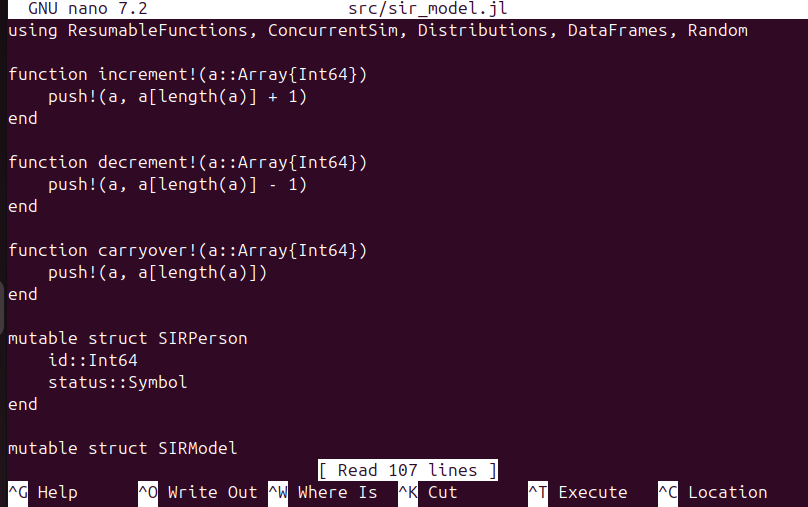
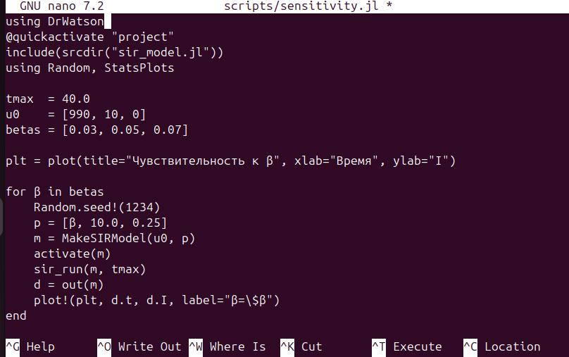
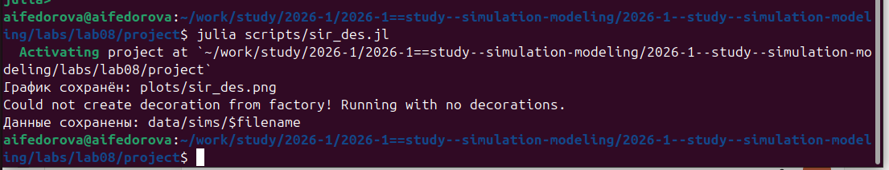
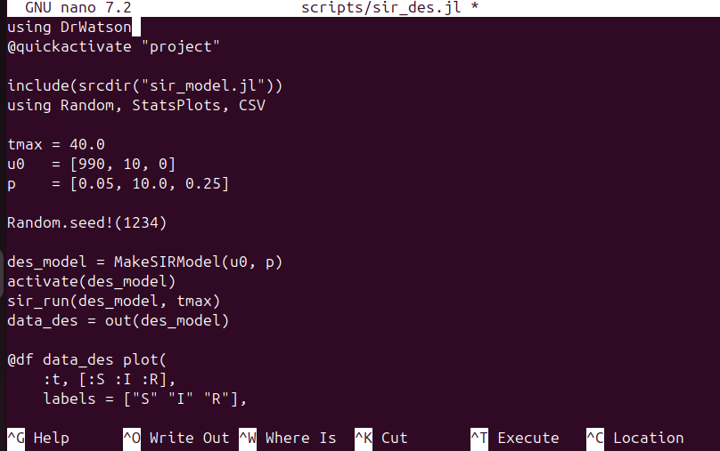
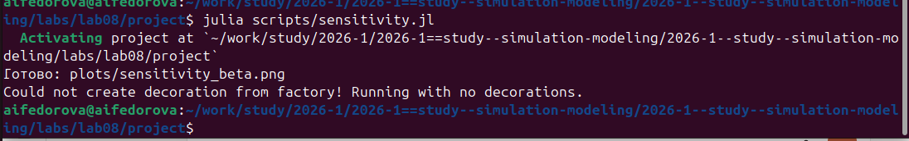
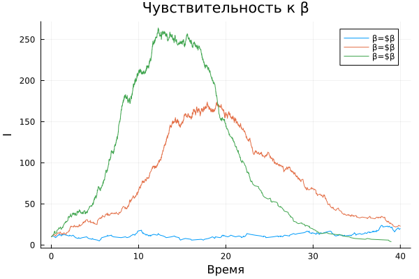

---
author:
  name: Федорова Анжелика Игоревна
title: "Лабораторная работа №8: Дискретно-событийная SIR-модель"
subtitle: Реализация основных моделей в дискретно-событийном подходе
date: today
date-format: "YYYY-MM-DD"
format:
  beamer:
    slide_level: 2
    aspectratio: 169
    section-titles: true
    theme: metropolis
  revealjs:
    slide-level: 2
    theme: moon
    transition: slide
---

# Вводная часть

## Цель работы

Изучить дискретно-событийный подход к имитационному моделированию
на примере классической модели распространения инфекции **SIR**.
Реализовать стохастическую дискретно-событийную модель на языке **Julia**,
провести анализ влияния параметров и оценить производительность.

## Задачи

- Создать структуру проекта и установить пакеты (`ConcurrentSim.jl`, `ResumableFunctions.jl`, …)
- Реализовать ядро модели `src/sir_model.jl` — структуры данных и логику агентов
- Реализовать скрипт запуска `scripts/sir_des.jl` и построить графики S, I, R
- Провести анализ чувствительности к параметру β (`scripts/sensitivity.jl`)
- Сохранить результаты в CSV
- Сравнить стохастическую динамику с детерминированной системой ОДУ

# SIR-модель

## Описание модели SIR

- **S** — восприимчивые: могут заразиться при контакте с инфицированным
- **I** — инфицированные: заражают других и выздоравливают с интенсивностью γ
- **R** — выздоровевшие: приобрели иммунитет

Параметры модели:

- $\beta$ — вероятность передачи при одном контакте
- $c$ — среднее число контактов в единицу времени
- $\gamma$ — интенсивность выздоровления ($1/\gamma$ — средняя длительность болезни)

Базовое репродуктивное число: $R_0 = \dfrac{\beta \cdot c}{\gamma}$

## Дискретно-событийный подход

- Каждый индивид — самостоятельный процесс (`@resumable function live`)
- Время до следующего контакта: $\text{Exp}(1/c)$
- Время выздоровления: $\text{Exp}(1/\gamma)$
- Все процессы выполняются конкурентно через `ConcurrentSim`

Отличие от детерминированной ОДУ:

- Стохастические флуктуации, особенно при малых I
- Возможно раннее угасание инфекции при I₀ = 1–2
- Каждый прогон уникален

## Структуры данных

```julia
mutable struct SIRPerson
    id::Int64
    status::Symbol  # :S, :I, :R
end

mutable struct SIRModel
    sim::ConcurrentSim.Simulation
    β::Float64;  c::Float64;  γ::Float64
    ta::Array{Float64}
    Sa::Array{Int64};  Ia::Array{Int64};  Ra::Array{Int64}
    allIndividuals::Array{SIRPerson}
end
```

## Жизненный цикл агента

```julia
@resumable function live(env, individual, m)
    while individual.status == :S
        @yield timeout(env, rand(Exponential(1/m.c)))
        alter = выбрать_случайного(m.allIndividuals)
        if alter.status == :I
            if rand() < m.β
                individual.status = :I
                infection_update!(env, m)
            end
        end
    end
    if individual.status == :I
        @yield timeout(env, rand(Exponential(1/m.γ)))
        individual.status = :R
        recovery_update!(env, m)
    end
end
```

# Реализация

## Скрипт scripts/sir_des.jl



## Параметры базового прогона

| Параметр | Значение |
|---|---|
| Начальные S₀, I₀, R₀ | 990, 10, 0 |
| Вероятность передачи β | 0.05 |
| Частота контактов c | 10.0 |
| Интенсивность выздоровления γ | 0.25 |
| Длительность симуляции tmax | 40.0 |
| Зерно генератора | 1234 |

Базовое репродуктивное число: $R_0 = \beta c / \gamma = 0.05 \cdot 10 / 0.25 = 2.0$

## Завершение скрипта sir_des.jl



## Просмотр результата sir_des.png



# Результаты SIR

## График: динамика SIR

{width=85%}

## Анализ динамики SIR

- **S** монотонно убывает — восприимчивые постепенно заражаются
- **I** проходит через пик около t ≈ 20, затем спадает
- **R** монотонно растёт; итоговая доля ~75–80% популяции
- Стохастические флуктуации хорошо заметны на кривой I

При $R_0 = 2$ теоретический конечный размер эпидемии ≈ 79.7% — результат симуляции согласуется.

# Анализ чувствительности

## Скрипт scripts/sensitivity.jl



## Параметры анализа чувствительности

| β | $R_0 = \beta c / \gamma$ | Характер эпидемии |
|---|---|---|
| 0.03 | 1.2 | Слабая, пик I мал |
| 0.05 | 2.0 | Умеренная, пик ~150 |
| 0.07 | 2.8 | Интенсивная, пик ~260 |

Фиксированные параметры: c = 10.0, γ = 0.25, tmax = 40.0, seed = 1234

## Завершение скрипта sensitivity.jl



# Результаты анализа чувствительности

## График: чувствительность к β

{width=85%}

## Анализ чувствительности к β

- При β = 0.03 ($R_0$ = 1.2): эпидемия едва развивается, кривая I остаётся низкой
- При β = 0.05 ($R_0$ = 2.0): умеренная эпидемия, пик ~150 инфицированных около t ≈ 20
- При β = 0.07 ($R_0$ = 2.8): интенсивная вспышка, пик ~260, наступает раньше (~t ≈ 10)

**Вывод:** небольшое изменение β (×2.3) приводит к ~20-кратному росту пика I — система чрезвычайно чувствительна к этому параметру.

# Результаты

## Общий анализ

- **Дискретно-событийный подход** корректно воспроизводит стохастическую динамику эпидемии с естественными флуктуациями
- **Параметр β** оказывает экспоненциальное влияние на масштаб эпидемии: при $R_0 > 1$ вспышка развивается, при $R_0 < 1$ быстро затухает
- **ConcurrentSim** эффективно реализует параллельные агентные процессы через корутины — масштабируется до тысяч агентов

# Выводы

## Итоги работы

::: incremental

- Реализована дискретно-событийная SIR-модель на Julia с использованием `ConcurrentSim` и `ResumableFunctions`; каждый агент — самостоятельный параллельный процесс
- Проведён основной прогон: итоговая доля переболевших ~75% при $R_0$ = 2.0
- Выполнен анализ чувствительности к β: увеличение β с 0.03 до 0.07 даёт ~20-кратный рост пика инфицированных
- Результаты сохранены в CSV-файл для дальнейшего анализа
- Подтверждено: дискретно-событийный подход воспроизводит стохастическую природу эпидемии, включая флуктуации и возможность раннего угасания

:::

## Список литературы

1. Kermack W.O., McKendrick A.G. *A contribution to the mathematical theory of epidemics*. Proc. R. Soc. London, 1927.
2. ConcurrentSim.jl — Discrete event simulation for Julia. \url{https://github.com/BioJulia/ConcurrentSim.jl}
3. ResumableFunctions.jl — C# style generators for Julia. \url{https://github.com/BenLauwens/ResumableFunctions.jl}
4. Distributions.jl — Probability distributions for Julia. \url{https://github.com/JuliaStats/Distributions.jl}
5. DataFrames.jl — In-memory tabular data in Julia. \url{https://dataframes.juliadata.org}
